# Roo Code Test 5: Make the entire Monopoly board game

Can a robot write Monopoly? Can a robot turn a ~~canvas~~`
` into a beautiful property? Can you?

I was bored, so I got a bunch of models to re-implement the classic friendship ruining experience in Roo Code.

## Cool Table

|Model|Playable?|Cost|Tokens|Requests|Date|
|---|---|---|---|---|---|
|openrouter/horizon-alpha|✅|FREE|5.86M|192|2025-08-02|
|openrouter/horizon-beta|❌|FREE|5.86M|148|2025-08-02|
|anthropic/claude-sonnet-4|❌|$28.4|29.5M|371|2025-08-01|
|google/gemini-2.5-pro|✅|$5.53|6.41M|239|2025-08-04|
|x-ai/grok-4|❌|$5.74|1.69M|92|2025-08-04|
|deepseek/deepseek-r1-0528|❌|$0.922|1.9M|55|2025-08-01|
|deepseek/deepseek-chat-v3-0324|❌|$2.41|6.41M|225|2025-08-04|
|qwen/qwen3-235b-a22b-thinking-2507|❌|$1.28|10.3M|288|2025-08-03|
|qwen/qwen3-coder|✅|$6.82|16.5M|287|2025-08-03|
|moonshotai/kimi-k2|❌|$12.85|20.28M|584|2025-08-03|
|z-ai/glm-4.5|❌|$3.6|9.1M|208|2025-08-02|

|Folder|Framework|Command In Folder|
|---|---|---|
|`horizon_alpha`|React.ts, Vite|`npm run dev`|
|`horizon_beta`|React.ts, Vite|`npm run dev`|
|`sonnet`|Vue.js, Vite|`npm run dev`|
|`gemini`|Pure HTML+CSS+JS|`python -m http.server`|
|`grok`|Express.js, React.js|`npm start`|
|`deepseek_r1`|Pure HTML+CSS+JS|`python -m http.server`|
|`deepseek_v3`|Express.ts, React.ts, Socket.IO|`npm start`|
|`qwen_thinking`|Pure HTML+CSS+JS|`python -m http.server`|
|`qwen_coder`|Pure HTML+CSS+JS|`python -m http.server`|
|`kimi`|Pure HTML+CSS+JS|`python -m http.server`|
|`glm`|Express.js, Socket.IO|`npm start`|

## Gallery

Playable ✅ (3 models)

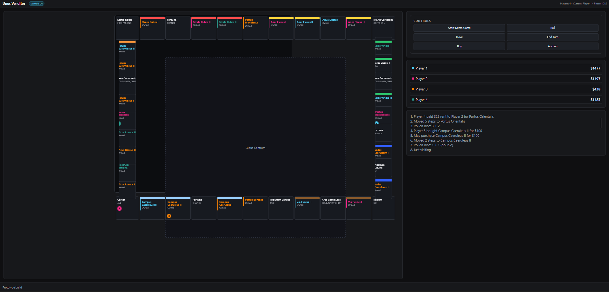
*Horizon Alpha - React.ts, Vite*

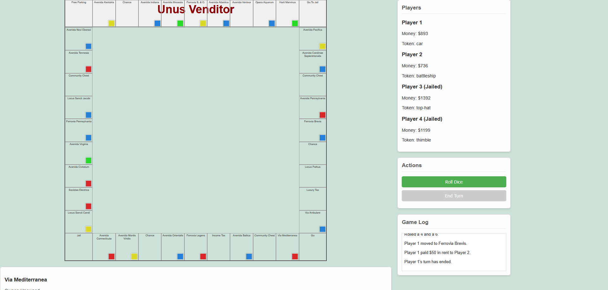
*Gemini 2.5 Pro - Pure HTML+CSS+JS*

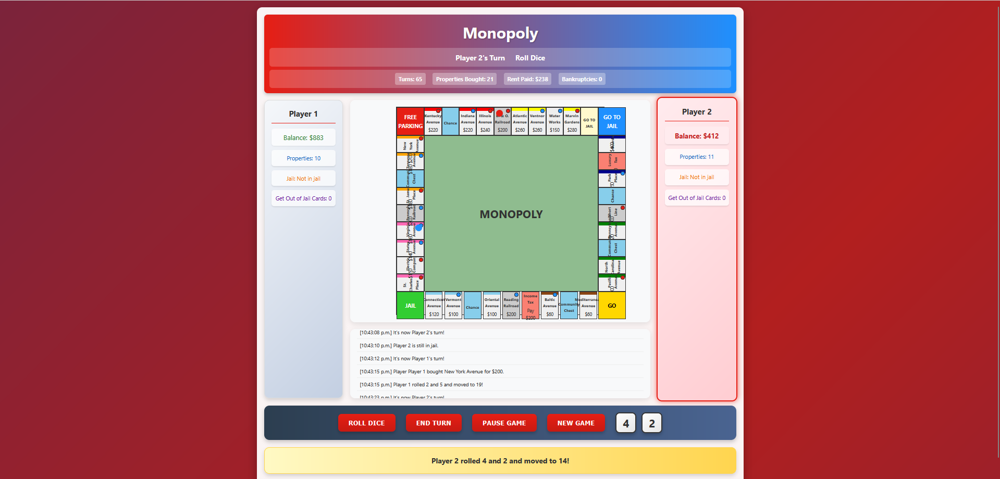
*Qwen3 Coder - Pure HTML+CSS+JS*

Not Playable ❌ (8 models)

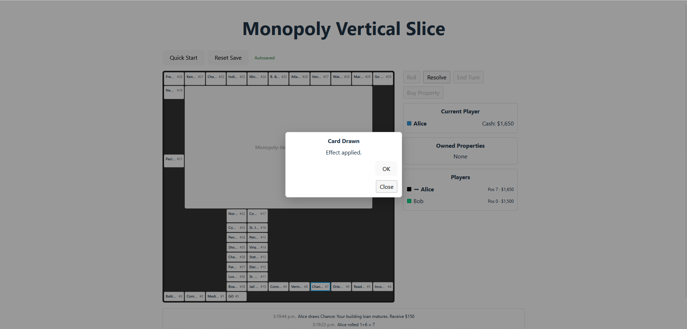
*Horizon Beta - React.ts, Vite*

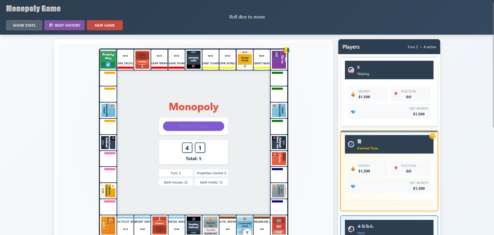
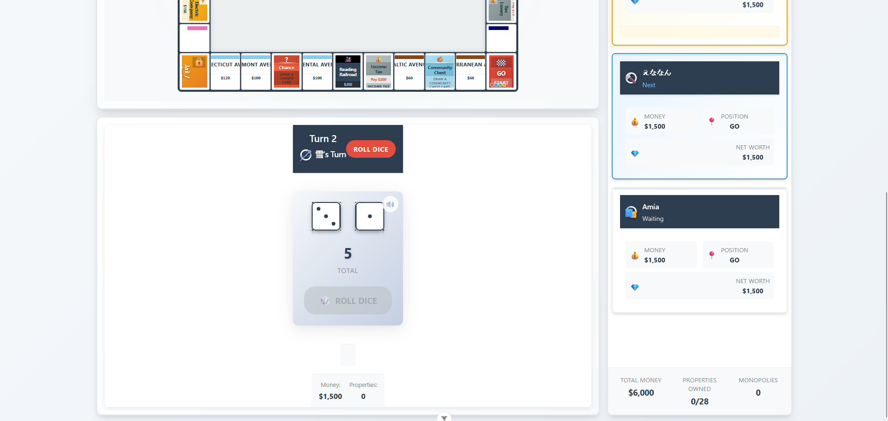
*Claude Sonnet 4 - Vue.js, Vite*

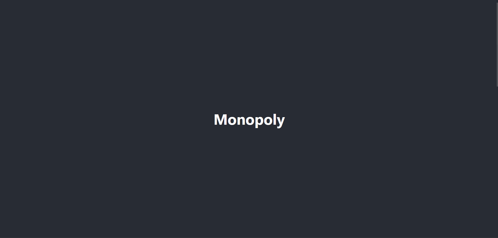
*Grok 4 - Pure HTML+CSS+JS*

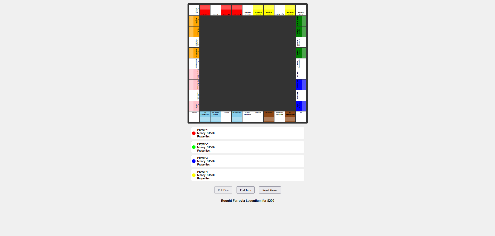
*Deepseek R1 - Pure HTML+CSS+JS*

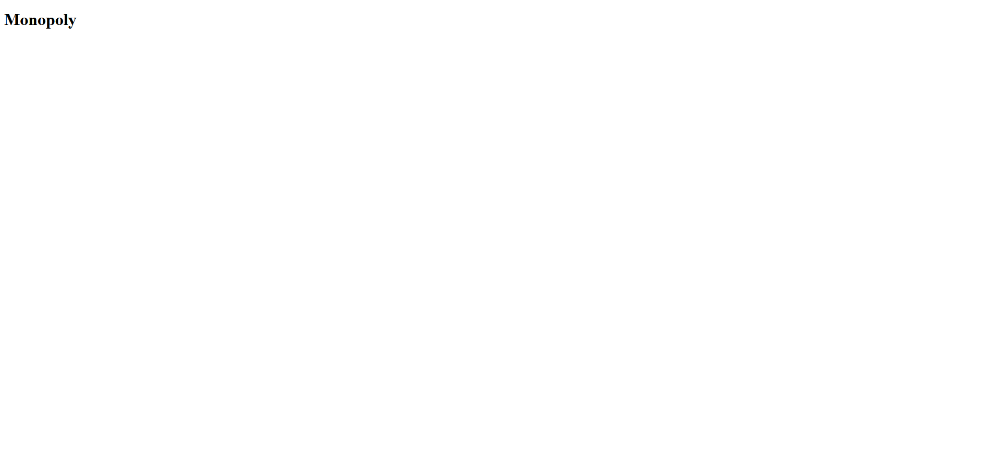
*Deepseek V3 - Express.ts, React.ts, Socket.IO*

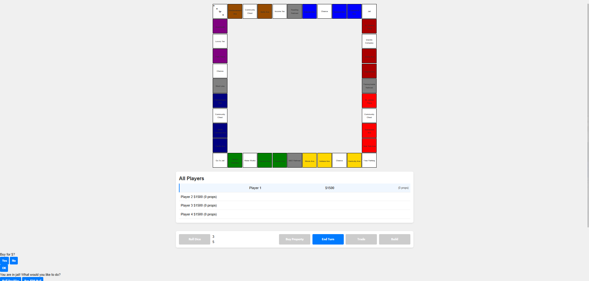
*Qwen3 Thinking - Pure HTML+CSS+JS*

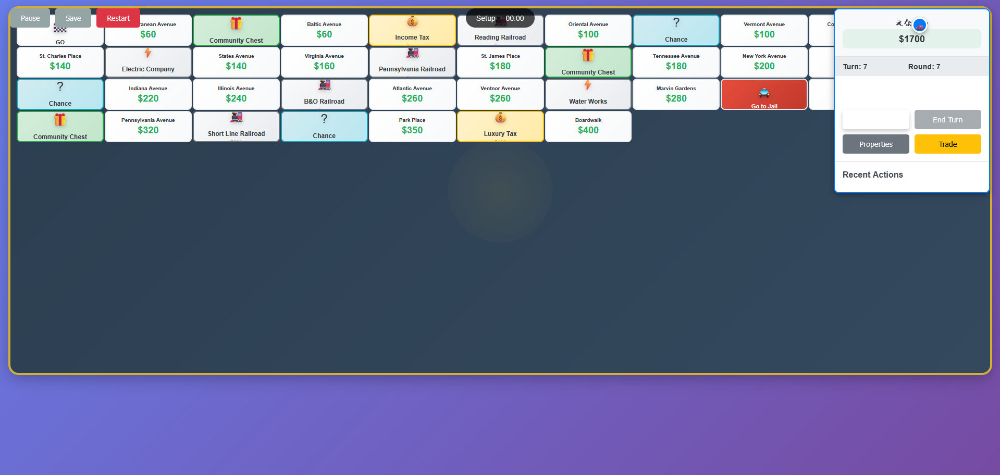
*Kimi K2 - Pure HTML+CSS+JS*

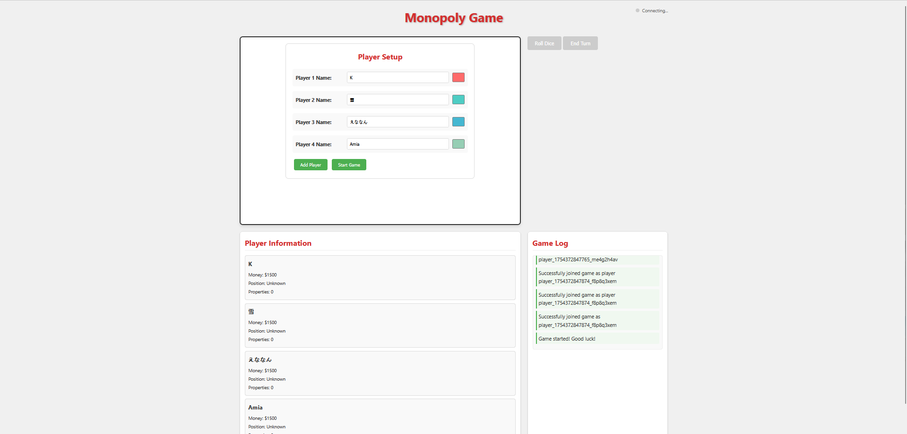
*GLM 4.5 - Express.js, Socket.IO*

## Repo Contents

- `.clinerules` tells the models about the project and implementation rules
- `.rooignore` hides the files of other models so the tested model doesn't get an idea of what framework to use. You will need to set **Settings > Context > Show .rooignore'd files in lists and searches** to off. Otherwise they will still be shown but with a lock in front
- `results.txt` is my notepad during tests
- `IMAGES/` contains the images for this gallery

## Methodology

Very poor science. n=1.

I started by telling the model (in an Orchestrator task) to delegate subtasks to implement Monopoly. When it uses a command to start a server (which blocks Roo Code), I open the web page, test the gameplay, and reply with observations and bugs.

I repeat this until no visible change or visible degradation occurs for 3 tests.

The test is not automated or a fair comparison. I give up when I feel like there's no point in continuing. A model that starts poorly but continues to improve can be given many "chances". On the other hand, it's good to know which models respond well to feedback and can ask for feedback at appropriate times, and which ones are too frustrating to work with.

I may know a bit about programming. I may have replied in ways that non-programmers or vibe coders wouldn't be able to.

A game is marked *playable* if it has movement, buying property, and rent. Most of these models also have jail and chance / community chest card mechanics that seem to work (I can't do a thorough analysis). No model that tried to implement trade, houses, or mortgaging also kept a playable core gameplay loop. Every project has UI bugs but I didn't think it was worth pursuing.

Most models used the default provider routing from OpenRouter. Qwen3 Thinking, Qwen3 Coder, and Kimi K2 are exceptions. See `results.txt` for details.

## Models I'd Like to Run but Can't

- o3: You need Tier 2 ($50) for the tokens per minute to not throttle Roo Code
- Opus 4: I have no money
- Other OpenAI models (o4-mini, o1, GPT 4.1) or weaker models from other providers: Monopoly is a task that stresses the planning, long horizon, and tool usage abilities of the best models available right now. I don't think anything less than o3 would be able to do it. Also I have no money (o1). Hopefully Horizon Alpha is representative of *something*.

## Quirks

- Horizon Alpha and Beta decided to implement their own `rng.ts` for some reason.
- Sonnet started by creating 10 .md files besides the `README.md` from Vue.js. It seemed to read these at reasonable points.
- Kimi also writes .md documentation. It even writes test .html files. It does so far more (18x .md, 13x .html) than even Sonnet. But it will *not* actually read the documentation it wrote previously or run the tests.
- Deepseek R1 and Qwen3 Thinking sometimes talk about "time constraints" in their thinking. "Due to time constraints, animations will not be implemented", etc. I don't know if this happened during their reinforcement learning or if they're just yapping.
- Problems keeping track of what's done / not done:
- - Horizon Beta
- - Deepseek R1
- - GLM 4.5
- Problems understanding Roo Code / tool use:
- - Grok (severe)
- - Deepseek R1
- - Qwen3 Thinking
- - Kimi K2
- Problems with not waiting for user review:
- - Horizon Beta
- - Deepseek V3
- - Qwen3 Thinking
- - Kimi K2 (severe)
- Problems lying ("Certainly!"):
- - Sonnet 4
- - Kimi K2 (severe)
