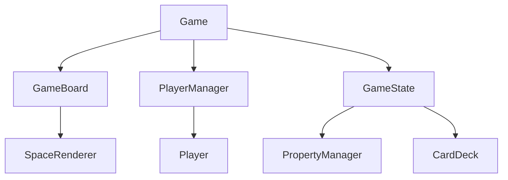
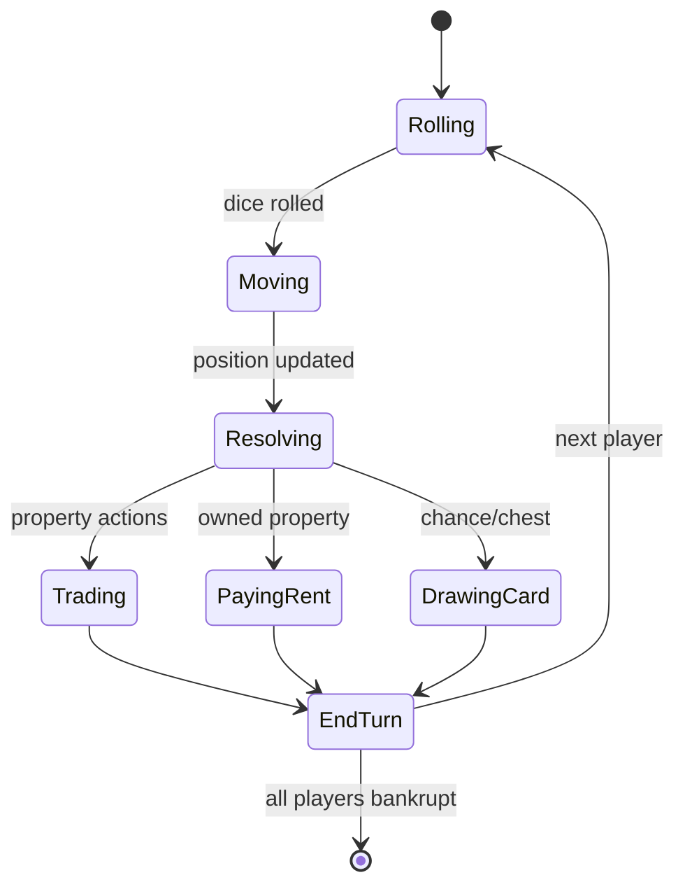

# Unus Venditor Architecture Document

## Game Mechanics Overview

### Core Rules
- 2-4 players controlled by the same user in one browser
- Players take turns in sequence (Player 1 → Player 2 → ... → Player 1)
- Numeric currency system (no physical money)
- Win condition: Last player remaining after others go bankrupt

### Turn Sequence
1. Roll dice
2. Move token
3. Resolve space effect:
   - Unowned property: Option to buy
   - Owned property: Pay rent
   - Chance/Community Chest: Draw card
   - Tax: Pay amount
   - Jail: Handle jail mechanics
4. End turn

### Property System
- 40 spaces: 22 properties, 4 railroads, 2 utilities, tax spaces, special spaces
- Rent calculation based on property type and ownership
- Mortgage system for properties

### Card System
- Chance/Community Chest cards with text-based effects
  - "Advance to Go"
  - "Pay school tax"
  - "Get Out of Jail Free"

## Tech Stack
- **Frontend**: HTML, CSS, JavaScript
- **No backend required** (single browser implementation)
- **No external frameworks** (vanilla JS for simplicity)

## File Structure
```
deepseek_r1/
├── index.html         # Main entry point
├── styles.css         # Global styles
├── script.js          # Game logic and state management
├── board.js           # Board rendering and space definitions
├── players.js         # Player management
├── properties.js      # Property data and logic
└── cards.js           # Chance/Community Chest cards
```

## Component Hierarchy



## State Management
- Central `gameState` object:
  ```javascript
  {
    players: [
      { id: 1, name: 'Player 1', position: 0, money: 1500, properties: [] }
    ],
    currentPlayerIndex: 0,
    properties: { /* ownership and improvement status */ },
    chanceDeck: [ /* card objects */ ],
    communityChestDeck: [ /* card objects */ ],
    gamePhase: 'rolling' // rolling, moving, resolving, ended
  }
  ```
- State transitions handled through discrete functions:
  - `rollDice()`
  - `movePlayer()`
  - `resolveSpace()`
  - `endTurn()`

## Data Structures
### Player Object
```javascript
{
  id: number,
  name: string,
  position: number,
  money: number,
  properties: number[], // property IDs
  inJail: boolean,
  getOutOfJailCards: number
}
```

### Property Object
```javascript
{
  id: number,
  name: string,
  type: 'property' | 'railroad' | 'utility' | 'tax' | 'special',
  price: number,
  rent: number[], // Base rent and improved rents
  colorGroup: string,
  houseCost: number // 0 for non-properties
}
```

### Card Object
```javascript
{
  id: number,
  type: 'chance' | 'communityChest',
  description: string,
  action: function // Modifies game state
}
```

## Game State Flow



## Implementation Roadmap

### Phase 1: Core Foundation (2 days)
1. Implement game board rendering
2. Create player management system
3. Implement dice rolling and movement
4. Basic turn structure

### Phase 2: Property System (3 days)
1. Property data modeling
2. Buying/selling logic
3. Rent calculation
4. Mortgage system

### Phase 3: Card System (1 day)
1. Card deck initialization
2. Card effect implementations
3. Card drawing UI

### Phase 4: Advanced Features (2 days)
1. Jail mechanics
2. Property improvements (houses/hotels)
3. Bankruptcy detection

### Phase 5: Polish & Testing (2 days)
1. UI refinements
2. Game balance testing
3. Edge case handling

### Risk Assessment
| Risk | Mitigation |
|------|------------|
| Complex state management | Use finite state machine pattern |
| UI performance issues | Optimize DOM updates |
| Rule ambiguities | Reference official Monopoly rules |
| Scope creep | Stick to core mechanics first |
