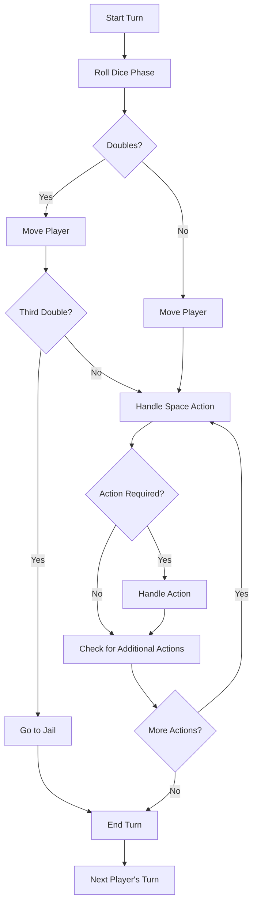

# Monopoly Game Architecture Design

## Table of Contents
1. [Overview](#overview)
2. [Game State Management Structure](#game-state-management-structure)
3. [Data Models](#data-models)
4. [Game Flow and Turn Management](#game-flow-and-turn-management)
5. [Event System](#event-system)
6. [Client-Server Communication](#client-server-communication)
7. [Game Mechanics Architecture](#game-mechanics-architecture)
8. [Real-time Updates and Synchronization](#real-time-updates-and-synchronization)
9. [State Validation](#state-validation)

## Overview

This document outlines the comprehensive architecture for implementing a Monopoly game as a single-player, single web browser application with multiple players taking turns. The architecture is designed to support all major Monopoly mechanics while maintaining clean separation of concerns between game logic, UI, and server-side validation.

### Current State Analysis

The existing implementation provides a basic foundation with:
- Express.js server setup
- Basic HTML structure
- Simplified game logic in `game.js`
- UI handling in `ui.js`
- Basic CSS styling

However, it lacks:
- Complete game board implementation
- Proper data models
- Socket.io integration for real-time updates
- Comprehensive game mechanics
- Server-side state management

## Game State Management Structure

### Architecture Overview

The game will follow a client-server architecture with the following components:

```
┌─────────────────┐    Socket.io Events    ┌─────────────────┐
│   Client UI     │ ◄────────────────────► │   Game Server   │
│   (Browser)     │                        │   (Node.js)     │
└─────────────────┘                        └─────────────────┘
      │                                               │
      │                                               │
      ▼                                               ▼
┌─────────────────┐                           ┌─────────────────┐
│   UI Controller │                           │ Game State Mgr  │
│   (ui.js)       │                           │ (gameState.js)  │
└─────────────────┘                           └─────────────────┘
      │                                               │
      │                                               │
      ▼                                               ▼
┌─────────────────┐                           ┌─────────────────┐
│   Game Logic    │                           │ Event Handler   │
│   (gameLogic.js)│                           │ (eventHandler.js)│
└─────────────────┘                           └─────────────────┘
```

### Game State Manager

The Game State Manager will be responsible for:
- Maintaining the authoritative game state
- Validating all game actions
- Broadcasting state changes to clients
- Persisting game state (if needed)

```javascript
// Game State Manager Structure
class GameStateManager {
    constructor() {
        this.gameState = {
            id: null,
            status: 'waiting', // waiting, active, paused, finished
            players: [],
            board: null,
            currentPlayerIndex: 0,
            turnPhase: 'waiting', // waiting, rolling, moving, acting
            dice: [0, 0],
            doubleCount: 0,
            auction: null,
            lastAction: null,
            winner: null
        };
        this.eventHistory = [];
        this.validator = new GameStateValidator();
    }
    
    // Methods for state management
    updateState(newState) { /* ... */ }
    validateAction(action) { /* ... */ }
    applyAction(action) { /* ... */ }
    broadcastState() { /* ... */ }
}
```

### State Synchronization Strategy

1. **Authoritative Server Model**: The server maintains the single source of truth
2. **Event-Driven Updates**: All state changes trigger events
3. **Delta Updates**: Only changed portions of state are sent to clients
4. **Optimistic UI**: Client updates UI immediately, then reconciles with server

## Data Models

### Player Model

```javascript
class Player {
    constructor(id, name, color) {
        this.id = id;
        this.name = name;
        this.color = color;
        this.money = 1500;
        this.position = 0;
        this.properties = [];
        this.inJail = false;
        this.jailTurns = 0;
        this.getOutOfJailCards = 0;
        this.bankrupt = false;
        this.doubleRolls = 0;
        this.totalRolls = 0;
        this.propertiesOwned = {
            brown: 0,
            lightBlue: 0,
            pink: 0,
            orange: 0,
            red: 0,
            yellow: 0,
            green: 0,
            darkBlue: 0,
            railroads: 0,
            utilities: 0
        };
    }
    
    // Player methods
    addProperty(property) { /* ... */ }
    removeProperty(propertyId) { /* ... */ }
    canAfford(amount) { /* ... */ }
    pay(amount, recipient = null) { /* ... */ }
    receive(amount) { /* ... */ }
    calculateTotalWorth() { /* ... */ }
}
```

### Property Model

```javascript
class Property {
    constructor(data) {
        this.id = data.id;
        this.name = data.name;
        this.type = data.type; // 'street', 'railroad', 'utility'
        this.position = data.position;
        this.colorGroup = data.colorGroup;
        this.price = data.price;
        this.mortgageValue = data.mortgageValue;
        this.isMortgaged = false;
        this.ownerId = null;
        this.buildings = 0; // 0-4 for houses, 5 for hotel
        this.rentLevels = data.rentLevels; // Array of rent amounts
        this.houseCost = data.houseCost;
        this.hotelCost = data.hotelCost;
    }
    
    // Property methods
    calculateRent() { /* ... */ }
    canBuildHouse() { /* ... */ }
    canBuildHotel() { /* ... */ }
    mortgage() { /* ... */ }
    unmortgage() { /* ... */ }
    getRentLevel() { /* ... */ }
}
```

### Space Model

```javascript
class Space {
    constructor(data) {
        this.id = data.id;
        this.name = data.name;
        this.type = data.type; // 'property', 'go', 'jail', 'freeParking', 'goToJail', 'tax', 'communityChest', 'chance'
        this.position = data.position;
        this.action = data.action || null;
        this.data = data.data || {}; // Additional data specific to space type
    }
    
    // Space methods
    onLand(player, game) { /* ... */ }
    getDisplayInfo() { /* ... */ }
}
```

### Card Model

```javascript
class Card {
    constructor(data) {
        this.id = data.id;
        this.type = data.type; // 'chance', 'communityChest'
        this.text = data.text;
        this.action = data.action;
        this.value = data.value || 0;
        this.moveTo = data.moveTo || null;
        this.description = data.description;
    }
    
    // Card methods
    execute(player, game) { /* ... */ }
    getDisplayText() { /* ... */ }
}
```

### Game State Model

```javascript
class GameState {
    constructor() {
        this.id = this.generateGameId();
        this.status = 'waiting'; // waiting, active, paused, finished
        this.players = [];
        this.board = null;
        this.currentPlayerIndex = 0;
        this.turnPhase = 'waiting'; // waiting, rolling, moving, acting
        this.dice = [0, 0];
        this.doubleCount = 0;
        this.auction = null;
        this.lastAction = null;
        this.winner = null;
        this.settings = {
            startingMoney: 1500,
            goAmount: 200,
            maxHousesPerProperty: 4,
            maxHotelsPerProperty: 1,
            jailFine: 50,
            doubleJailLimit: 3
        };
        this.createdAt = new Date();
        this.lastUpdatedAt = new Date();
    }
    
    // Game state methods
    addPlayer(player) { /* ... */ }
    removePlayer(playerId) { /* ... */ }
    getCurrentPlayer() { /* ... */ }
    nextPlayer() { /* ... */ }
    isGameActive() { /* ... */ }
    checkWinCondition() { /* ... */ }
    generateGameId() { /* ... */ }
}
```

## Game Flow and Turn Management

### Turn Management System

```javascript
class TurnManager {
    constructor(gameState) {
        this.gameState = gameState;
        this.currentPhase = 'waiting'; // waiting, rolling, moving, acting, ended
        this.actionsTaken = [];
    }
    
    // Turn management methods
    startTurn() { /* ... */ }
    rollDice() { /* ... */ }
    movePlayer(spaces) { /* ... */ }
    handleSpaceAction() { /* ... */ }
    endTurn() { /* ... */ }
    canRoll() { /* ... */ }
    canEndTurn() { /* ... */ }
}
```

### Turn Flow Diagram



### Game Phases

1. **Setup Phase**: Player creation, game initialization
2. **Active Phase**: Normal gameplay with turns
3. **Auction Phase**: Property bidding when player declines purchase
4. **Bankruptcy Phase**: Handling player bankruptcy
5. **End Game Phase**: Determining winner and game conclusion

## Event System

### Event Types

```javascript
// Event definitions
const GameEvents = {
    // Game lifecycle events
    GAME_CREATED: 'game:created',
    GAME_STARTED: 'game:started',
    GAME_PAUSED: 'game:paused',
    GAME_RESUMED: 'game:resumed',
    GAME_ENDED: 'game:ended',
    
    // Player events
    PLAYER_JOINED: 'player:joined',
    PLAYER_LEFT: 'player:left',
    PLAYER_TURN_STARTED: 'player:turn:started',
    PLAYER_TURN_ENDED: 'player:turn:ended',
    PLAYER_MOVED: 'player:moved',
    PLAYER_MONEY_CHANGED: 'player:money:changed',
    PLAYER_BANKRUPT: 'player:bankrupt',
    PLAYER_JAILED: 'player:jailed',
    PLAYER_RELEASED: 'player:released',
    
    // Dice events
    DICE_ROLLED: 'dice:rolled',
    
    // Property events
    PROPERTY_PURCHASED: 'property:purchased',
    PROPERTY_MORTGAGED: 'property:mortgaged',
    PROPERTY_UNMORTGAGED: 'property:unmortgaged',
    BUILDING_BUILT: 'building:built',
    BUILDING_SOLD: 'building:sold',
    
    // Card events
    CARD_DRAWN: 'card:drawn',
    
    // Auction events
    AUCTION_STARTED: 'auction:started',
    AUCTION_BID: 'auction:bid',
    AUCTION_ENDED: 'auction:ended',
    
    // State events
    STATE_CHANGED: 'state:changed',
    ERROR_OCCURRED: 'error:occurred'
};
```

### Event Handler

```javascript
class EventHandler {
    constructor(gameState, socketManager) {
        this.gameState = gameState;
        this.socketManager = socketManager;
        this.eventListeners = {};
        this.setupEventHandlers();
    }
    
    // Event handling methods
    on(event, callback) { /* ... */ }
    emit(event, data) { /* ... */ }
    setupEventHandlers() { /* ... */ }
    handleGameAction(action) { /* ... */ }
    validateEvent(event, data) { /* ... */ }
}
```

## Client-Server Communication

### Socket.io Integration

```javascript
// Server-side socket manager
class SocketManager {
    constructor(server) {
        this.io = require('socket.io')(server);
        this.gameRooms = new Map();
        this.setupSocketHandlers();
    }
    
    // Socket management methods
    setupSocketHandlers() { /* ... */ }
    joinGame(socket, gameId, playerId) { /* ... */ }
    leaveGame(socket, gameId, playerId) { /* ... */ }
    sendGameState(socket, gameState) { /* ... */ }
    broadcastGameState(gameId, gameState) { /* ... */ }
    handleGameAction(socket, action) { /* ... */ }
}
```

### Communication Protocol

```javascript
// Client-Server message format
const MessageFormat = {
    // Client to Server
    JOIN_GAME: {
        type: 'join_game',
        data: {
            gameId: 'string',
            playerName: 'string',
            playerColor: 'string'
        }
    },
    
    ROLL_DICE: {
        type: 'roll_dice',
        data: {
            gameId: 'string',
            playerId: 'string'
        }
    },
    
    // Server to Client
    GAME_STATE_UPDATE: {
        type: 'game_state_update',
        data: {
            gameState: 'object',
            delta: 'object' // Only changed fields
        }
    },
    
    GAME_EVENT: {
        type: 'game_event',
        data: {
            eventType: 'string',
            eventData: 'object',
            timestamp: 'number'
        }
    }
};
```

## Game Mechanics Architecture

### Dice Rolling System

```javascript
class DiceManager {
    constructor() {
        this.dice = [0, 0];
        this.isRolling = false;
        this.rollHistory = [];
    }
    
    // Dice methods
    roll() { /* ... */ }
    isDoubles() { /* ... */ }
    getTotal() { /* ... */ }
    getRollHistory() { /* ... */ }
    clearHistory() { /* ... */ }
}
```

### Movement System

```javascript
class MovementManager {
    constructor(gameState) {
        this.gameState = gameState;
    }
    
    // Movement methods
    movePlayer(player, spaces) { /* ... */ }
    movePlayerToPosition(player, position) { /* ... */ }
    movePlayerToJail(player) { /* ... */ }
    handlePassingGo(player) { /* ... */ }
    calculateMovementPath(from, to) { /* ... */ }
}
```

### Property Transaction System

```javascript
class PropertyManager {
    constructor(gameState) {
        this.gameState = gameState;
    }
    
    // Property transaction methods
    purchaseProperty(player, property) { /* ... */ }
    sellProperty(player, property) { /* ... */ }
    mortgageProperty(player, property) { /* ... */ }
    unmortgageProperty(player, property) { /* ... */ }
    transferProperty(fromPlayer, toPlayer, property) { /* ... */ }
    startAuction(property) { /* ... */ }
    placeBid(player, property, amount) { /* ... */ }
    concludeAuction() { /* ... */ }
}
```

### Rent Calculation System

```javascript
class RentCalculator {
    constructor() {
        this.rentMultipliers = {
            monopoly: 2, // Rent doubles with monopoly
            house: [1, 3, 6, 8], // Multipliers for 1-4 houses
            hotel: 10 // Multiplier for hotel
        };
    }
    
    // Rent calculation methods
    calculateRent(property, gameState) { /* ... */ }
    calculatePropertyRent(property, diceRoll = 0) { /* ... */ }
    hasMonopoly(player, colorGroup) { /* ... */ }
    getBuildingLevel(property) { /* ... */ }
    calculateUtilityRent(property, diceRoll) { /* ... */ }
    calculateRailroadRent(property, gameState) { /* ... */ }
}
```

### Jail System

```javascript
class JailManager {
    constructor(gameState) {
        this.gameState = gameState;
    }
    
    // Jail management methods
    sendToJail(player) { /* ... */ }
    releaseFromJail(player) { /* ... */ }
    attemptRollForDoubles(player) { /* ... */ }
    payJailFine(player) { /* ... */ }
    useGetOutOfJailCard(player) { /* ... */ }
    isInJail(player) { /* ... */ }
    getJailTurns(player) { /* ... */ }
}
```

### Bankruptcy System

```javascript
class BankruptcyManager {
    constructor(gameState) {
        this.gameState = gameState;
    }
    
    // Bankruptcy methods
    declareBankruptcy(player) { /* ... */ }
    liquidateAssets(player) { /* ... */ }
    transferAssetsToCreditor(player, creditor) { /* ... */ }
    canPayDebt(player, amount) { /* ... */ }
    calculateTotalAssets(player) { /* ... */ }
    checkBankruptcyConditions(player) { /* ... */ }
}
```

## Real-time Updates and Synchronization

### State Synchronization Strategy

```javascript
class StateSynchronizer {
    constructor(socketManager, gameState) {
        this.socketManager = socketManager;
        this.gameState = gameState;
        this.clientStates = new Map();
        this.updateQueue = [];
        this.isProcessing = false;
    }
    
    // Synchronization methods
    queueUpdate(update) { /* ... */ }
    processUpdates() { /* ... */ }
    broadcastDelta(delta) { /* ... */ }
    registerClient(clientId, initialState) { /* ... */ }
    unregisterClient(clientId) { /* ... */ }
    reconcileState(clientId, clientState) { /* ... */ }
}
```

### Optimistic Updates

```javascript
// Client-side optimistic update handler
class OptimisticUpdateHandler {
    constructor(gameUI) {
        this.gameUI = gameUI;
        this.pendingActions = new Map();
        this.reconciliationQueue = [];
    }
    
    // Optimistic update methods
    applyOptimisticUpdate(action) { /* ... */ }
    confirmAction(actionId, serverState) { /* ... */ }
    rejectAction(actionId, serverState) { /* ... */ }
    rollbackAction(actionId) { /* ... */ }
    reconcileState(serverState) { /* ... */ }
}
```

## State Validation

### Server-side Validation

```javascript
class GameStateValidator {
    constructor() {
        this.validationRules = new Map();
        this.setupValidationRules();
    }
    
    // Validation methods
    validateAction(action, gameState) { /* ... */ }
    validateGameState(gameState) { /* ... */ }
    validatePlayerAction(player, action, gameState) { /* ... */ }
    validatePropertyTransaction(transaction, gameState) { /* ... */ }
    validateMove(player, from, to, gameState) { /* ... */ }
    setupValidationRules() { /* ... */ }
    getValidationErrors() { /* ... */ }
}
```

### Validation Rules

```javascript
// Validation rules configuration
const ValidationRules = {
    // Turn validation
    TURN_ROLL: {
        currentPlayerOnly: true,
        phase: 'rolling',
        maxRolls: 3,
        conditions: ['notInJail', 'gameActive']
    },
    
    // Property validation
    PROPERTY_PURCHASE: {
        currentPlayerOnly: true,
        phase: 'acting',
        conditions: ['propertyUnowned', 'sufficientFunds', 'gameActive']
    },
    
    // Building validation
    BUILD_HOUSE: {
        currentPlayerOnly: true,
        phase: 'acting',
        conditions: ['ownsProperty', 'hasMonopoly', 'sufficientFunds', 'buildingLimits']
    }
};
```

## Implementation Roadmap

### Phase 1: Core Architecture
1. Implement GameStateManager
2. Create data models
3. Set up Socket.io communication
4. Implement basic event system

### Phase 2: Game Mechanics
1. Implement turn management
2. Add dice rolling and movement
3. Create property transaction system
4. Implement rent calculation

### Phase 3: Advanced Features
1. Add jail system
2. Implement bankruptcy handling
3. Create auction system
4. Add card deck functionality

### Phase 4: Polish and Optimization
1. Implement real-time synchronization
2. Add state validation
3. Optimize performance
4. Add error handling and recovery

## Conclusion

This architecture provides a comprehensive foundation for implementing a fully-featured Monopoly game with proper separation of concerns, real-time updates, and robust state management. The design supports all major Monopoly mechanics while maintaining flexibility for future enhancements.

The architecture follows best practices for:
- Separation of concerns
- Event-driven design
- State management
- Real-time synchronization
- Validation and error handling

This design document will guide the implementation phase, ensuring a maintainable and scalable codebase.