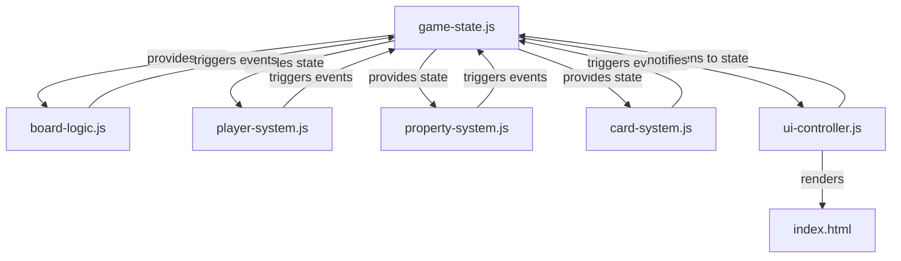

# Modular Architecture Design for Enhanced Monopoly Implementation

## 1. File Structure Overview



### Core Modules

#### [`game-state.js`](qwen_thinking/game-state.js:0)
**Responsibilities**:
- Centralized game state management (players, board configuration, game phase)
- State validation and integrity checks
- Event emission system for state changes

**Key Exports**:
```javascript
export const gameState = {
  players: [],
  boardSpaces: [],
  currentPlayerIndex: 0,
  gamePhase: 'setup' // 'rolling', 'buying', 'trading', 'ended'
};

export function updateState(updates) {
  // Deep merge updates while maintaining immutability
  // Emits 'stateUpdated' event
}

export function subscribe(event, callback) {
  // Event subscription system
}
```

#### [`board-logic.js`](qwen_thinking/board-logic.js:0)
**Responsibilities**:
- Board movement calculations and validation
- Space interaction handling (properties, railroads, utilities)
- Go/Jail/Free Parking mechanics

**Key Exports**:
```javascript
export function movePlayer(playerId, spaces) {
  // Returns { newPosition, passedGo }
}

export function handleSpaceInteraction(playerId, spaceIndex) {
  // Returns { actionType, payload }
}

export function calculateRent(spaceIndex, diceTotal) {
  // Returns calculated rent amount
}
```

#### [`card-system.js`](qwen_thinking/card-system.js:0)
**Responsibilities**:
- Chance/Community Chest deck management
- Card effect execution
- Deck shuffling and draw mechanics

**Key Exports**:
```javascript
export const CARD_DECKS = {
  chance: [/* 16+ cards */],
  communityChest: [/* 16+ cards */]
};

export function drawCard(deckType) {
  // Returns { card, remainingCount }
}

export function executeCardEffect(card, playerId) {
  // Applies card effect to game state
}
```

#### [`player-system.js`](qwen_thinking/player-system.js:0)
**Responsibilities**:
- Turn management and sequencing
- Trading interface implementation
- Bankruptcy handling

**Key Exports**:
```javascript
export function startTurn(playerId) {
  // Initializes turn sequence
}

export function endTurn() {
  // Validates turn completion
}

export function initiateTrade(playerId, targetPlayerId, offer) {
  // Returns trade proposal object
}

export function resolveTrade(tradeId, accepted) {
  // Finalizes trade execution
}
```

#### [`property-system.js`](qwen_thinking/property-system.js:0)
**Responsibilities**:
- Property ownership tracking
- House/hotel construction mechanics
- Monopoly group validation
- Rent calculation with improvements

**Key Exports**:
```javascript
export function purchaseProperty(playerId, spaceIndex) {
  // Returns { success, newBalance }
}

export function buildStructure(spaceIndex, structureType) {
  // Validates and applies construction
}

export function getMonopolyGroups(playerId) {
  // Returns { color: [spaces] } for complete groups
}
```

#### [`ui-controller.js`](qwen_thinking/ui-controller.js:0)
**Responsibilities**:
- DOM state synchronization
- Player token positioning
- Notification system management
- Mobile-responsive UI adaptations

**Key Exports**:
```javascript
export function initializeUI() {
  // Sets up event listeners and initial rendering
}

export function updatePlayerPanel(playerId) {
  // Updates player info section
}

export function highlightBoardPosition(spaceIndex) {
  // Animates token movement
}

export function showNotification(message, type) {
  // Creates timed UI notification
}
```

## 2. Key Interfaces and Communication

### Event-Driven Architecture
All modules communicate through the central game state using a publish-subscribe pattern:

```javascript
// Example: Board movement triggers
import { subscribe, updateState } from './game-state.js';

// In board-logic.js
subscribe('playerMoved', ({ playerId, newPosition }) => {
  const space = gameState.boardSpaces[newPosition];
  if (space.type === 'property' && !space.owner) {
    updateState({ currentAction: 'purchasePrompt' });
  }
});

// In ui-controller.js
subscribe('stateUpdated', (updates) => {
  if (updates.currentPlayerIndex) {
    updatePlayerPanel(updates.currentPlayerIndex);
  }
});
```

### Centralized State Access Pattern
All modules access state through the game-state module rather than direct DOM manipulation:

```javascript
// Anti-pattern (avoid)
const balance = document.getElementById('balance').textContent;

// Correct pattern
import { gameState } from './game-state.js';
const balance = gameState.players[currentPlayer].balance;
```

## 3. Feature Mapping

| User Requirement          | Primary Module(s)               | Implementation Notes                          |
|---------------------------|---------------------------------|-----------------------------------------------|
| User-controlled turns     | player-system.js                | Turn queue management with state validation   |
| Houses/hotels             | property-system.js              | Requires monopoly group validation first      |
| Trading interface         | player-system.js + ui-controller.js | Modal UI + state synchronization          |
| Color bar property names  | ui-controller.js + style.css    | Dynamic class assignment based on space data  |
| Mobile responsiveness     | ui-controller.js + style.css    | Viewport-aware layout adjustments           |
| Card effects              | card-system.js + board-logic.js | Effect chaining for complex card interactions|
| Bankruptcy handling       | player-system.js + property-system.js | Property transfer logic                   |

## 4. Constraints Compliance

### Single HTML Entry Point
```html
<!-- index.html -->
<script type="module">
  import './game-state.js';
  import './board-logic.js';
  import './ui-controller.js';
  
  // Initialize game sequence
  document.addEventListener('DOMContentLoaded', () => {
    initializeUI();
    startGame();
  });
</script>
```

### ES6 Module Compatibility
- All modules use `export`/`import` syntax
- No bundler dependencies
- Native browser module support
- Circular dependency prevention through event-based communication

### Text-Only Representation
- All game elements use semantic HTML with CSS styling
- No image dependencies
- Color-coded properties through CSS classes
- Text-based notifications for all game events

### Mobile Responsiveness
- Viewport-aware board scaling
- Touch-friendly action buttons
- Notification system with proper stacking
- Dynamic font sizing for property names

## 5. Implementation Roadmap

1. **Core State Initialization**  
   - Implement game-state.js with observable pattern
   - Migrate existing state variables from monolithic implementation

2. **Board Mechanics Refactoring**  
   - Extract movement logic from game.js
   - Implement space interaction handlers

3. **UI Controller Integration**  
   - Replace direct DOM manipulation with state-driven updates
   - Implement animation sequences through CSS classes

4. **Property System Enhancement**  
   - Add house/hotel construction mechanics
   - Implement monopoly group validation

5. **Card System Expansion**  
   - Populate full Chance/Community Chest decks
   - Implement card effect chaining

6. **Trading Interface Development**  
   - Create trade proposal UI components
   - Implement trade resolution logic

7. **Final Integration Testing**  
   - Validate all module interactions
   - Verify constraint compliance