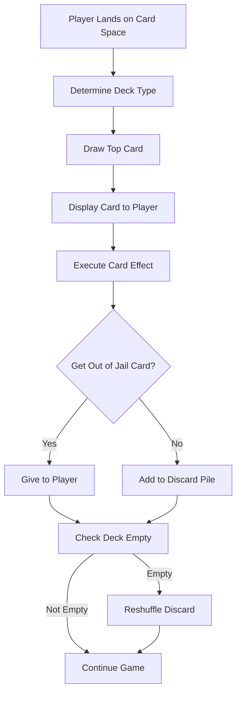

# Card Systems Design

## Card System Architecture

### Card Management Overview

The card system handles two distinct deck types (Chance and Community Chest) with shared mechanics but different thematic content. Each deck contains approximately 16 cards with various effects ranging from simple money transactions to complex property-based calculations.

### Card Processing Flow



## Complete Card Definitions

### Chance Cards (16 Cards)

```javascript
const chanceCards = [
  {
    id: 'chance_01',
    title: 'Advance to GO',
    description: 'Advance to GO (Collect $200)',
    type: 'move',
    action: 'moveToSpace',
    targetPosition: 0,
    collectGoBonus: true,
    effectValue: 200
  },
  {
    id: 'chance_02',
    title: 'Advance to Illinois Ave',
    description: 'Advance to Illinois Ave. If you pass GO, collect $200',
    type: 'move',
    action: 'moveToSpace',
    targetPosition: 24, // Illinois Avenue
    collectGoBonus: true
  },
  {
    id: 'chance_03',
    title: 'Advance to St. Charles Place',
    description: 'Advance to St. Charles Place. If you pass GO, collect $200',
    type: 'move',
    action: 'moveToSpace',
    targetPosition: 11, // St. Charles Place
    collectGoBonus: true
  },
  {
    id: 'chance_04',
    title: 'Advance to Nearest Utility',
    description: 'Advance to nearest Utility. If unowned, you may buy it. If owned, pay owner 10× dice roll',
    type: 'move',
    action: 'moveToNearestUtility',
    rentMultiplier: 10
  },
  {
    id: 'chance_05',
    title: 'Advance to Nearest Railroad',
    description: 'Advance to nearest Railroad. If unowned, you may buy it. If owned, pay double rent',
    type: 'move',
    action: 'moveToNearestRailroad',
    rentMultiplier: 2
  },
  {
    id: 'chance_06',
    title: 'Advance to Nearest Railroad',
    description: 'Advance to nearest Railroad. If unowned, you may buy it. If owned, pay double rent',
    type: 'move',
    action: 'moveToNearestRailroad',
    rentMultiplier: 2
  },
  {
    id: 'chance_07',
    title: 'Bank Dividend',
    description: 'Bank pays you dividend of $50',
    type: 'money',
    action: 'receiveMoney',
    effectValue: 50,
    fromBank: true
  },
  {
    id: 'chance_08',
    title: 'Get Out of Jail Free',
    description: 'Get Out of Jail Free. This card may be kept until needed or traded',
    type: 'special',
    action: 'getOutOfJailFree',
    isGetOutOfJail: true,
    tradeable: true
  },
  {
    id: 'chance_09',
    title: 'Go Back 3 Spaces',
    description: 'Go back 3 spaces',
    type: 'move',
    action: 'moveRelative',
    effectValue: -3
  },
  {
    id: 'chance_10',
    title: 'Go to Jail',
    description: 'Go directly to Jail. Do not pass GO, do not collect $200',
    type: 'special',
    action: 'goToJail'
  },
  {
    id: 'chance_11',
    title: 'Property Repairs',
    description: 'Make general repairs on all your property: For each house pay $25, for each hotel pay $100',
    type: 'property',
    action: 'payPerProperty',
    perHouseAmount: 25,
    perHotelAmount: 100
  },
  {
    id: 'chance_12',
    title: 'Speeding Fine',
    description: 'Speeding fine $15',
    type: 'money',
    action: 'payMoney',
    effectValue: 15,
    toBank: true
  },
  {
    id: 'chance_13',
    title: 'Trip to Reading Railroad',
    description: 'Take a trip to Reading Railroad. If you pass GO, collect $200',
    type: 'move',
    action: 'moveToSpace',
    targetPosition: 5, // Reading Railroad
    collectGoBonus: true
  },
  {
    id: 'chance_14',
    title: 'Trip to Boardwalk',
    description: 'Take a walk on the Boardwalk. Advance token to Boardwalk',
    type: 'move',
    action: 'moveToSpace',
    targetPosition: 39 // Boardwalk
  },
  {
    id: 'chance_15',
    title: 'Chairman Elected',
    description: 'You have been elected Chairman of the Board. Pay each player $50',
    type: 'money',
    action: 'payEachPlayer',
    effectValue: 50
  },
  {
    id: 'chance_16',
    title: 'Building Loan Matures',
    description: 'Your building loan matures. Collect $150',
    type: 'money',
    action: 'receiveMoney',
    effectValue: 150,
    fromBank: true
  }
];
```

### Community Chest Cards (16 Cards)

```javascript
const communityChestCards = [
  {
    id: 'community_01',
    title: 'Advance to GO',
    description: 'Advance to GO (Collect $200)',
    type: 'move',
    action: 'moveToSpace',
    targetPosition: 0,
    collectGoBonus: true,
    effectValue: 200
  },
  {
    id: 'community_02',
    title: 'Bank Error',
    description: 'Bank error in your favor. Collect $200',
    type: 'money',
    action: 'receiveMoney',
    effectValue: 200,
    fromBank: true
  },
  {
    id: 'community_03',
    title: 'Doctor\'s Fee',
    description: 'Doctor\'s fees. Pay $50',
    type: 'money',
    action: 'payMoney',
    effectValue: 50,
    toBank: true
  },
  {
    id: 'community_04',
    title: 'Stock Sale',
    description: 'From sale of stock you get $50',
    type: 'money',
    action: 'receiveMoney',
    effectValue: 50,
    fromBank: true
  },
  {
    id: 'community_05',
    title: 'Get Out of Jail Free',
    description: 'Get Out of Jail Free. This card may be kept until needed or traded',
    type: 'special',
    action: 'getOutOfJailFree',
    isGetOutOfJail: true,
    tradeable: true
  },
  {
    id: 'community_06',
    title: 'Go to Jail',
    description: 'Go directly to Jail. Do not pass GO, do not collect $200',
    type: 'special',
    action: 'goToJail'
  },
  {
    id: 'community_07',
    title: 'Holiday Fund Matures',
    description: 'Holiday fund matures. Receive $100',
    type: 'money',
    action: 'receiveMoney',
    effectValue: 100,
    fromBank: true
  },
  {
    id: 'community_08',
    title: 'Income Tax Refund',
    description: 'Income tax refund. Collect $20',
    type: 'money',
    action: 'receiveMoney',
    effectValue: 20,
    fromBank: true
  },
  {
    id: 'community_09',
    title: 'Birthday Money',
    description: 'It is your birthday. Collect $10 from every player',
    type: 'money',
    action: 'receiveFromEachPlayer',
    effectValue: 10
  },
  {
    id: 'community_10',
    title: 'Life Insurance Matures',
    description: 'Life insurance matures. Collect $100',
    type: 'money',
    action: 'receiveMoney',
    effectValue: 100,
    fromBank: true
  },
  {
    id: 'community_11',
    title: 'Hospital Fees',
    description: 'Pay hospital fees of $100',
    type: 'money',
    action: 'payMoney',
    effectValue: 100,
    toBank: true
  },
  {
    id: 'community_12',
    title: 'School Fees',
    description: 'Pay school fees of $50',
    type: 'money',
    action: 'payMoney',
    effectValue: 50,
    toBank: true
  },
  {
    id: 'community_13',
    title: 'Consultancy Fee',
    description: 'Receive $25 consultancy fee',
    type: 'money',
    action: 'receiveMoney',
    effectValue: 25,
    fromBank: true
  },
  {
    id: 'community_14',
    title: 'Street Repairs',
    description: 'You are assessed for street repairs: $40 per house, $115 per hotel',
    type: 'property',
    action: 'payPerProperty',
    perHouseAmount: 40,
    perHotelAmount: 115
  },
  {
    id: 'community_15',
    title: 'Beauty Contest',
    description: 'You have won second prize in a beauty contest. Collect $10',
    type: 'money',
    action: 'receiveMoney',
    effectValue: 10,
    fromBank: true
  },
  {
    id: 'community_16',
    title: 'Inheritance',
    description: 'You inherit $100',
    type: 'money',
    action: 'receiveMoney',
    effectValue: 100,
    fromBank: true
  }
];
```

## Card Effect Implementation

### Card Action Handler System

```javascript
const cardActionHandlers = {
  // Movement actions
  moveToSpace(player, card, gameState) {
    const currentPosition = player.position;
    const targetPosition = card.targetPosition;
    
    // Check if passing GO
    if (card.collectGoBonus && targetPosition < currentPosition) {
      gameState.transferMoney('bank', player.id, 200);
      gameState.addMessage(`${player.name} passed GO and collected $200`);
    }
    
    // Move player
    player.position = targetPosition;
    gameState.addMessage(`${player.name} moves to ${gameState.board[targetPosition].name}`);
    
    // Handle landing effect
    gameState.processLanding(player.id, targetPosition);
  },
  
  moveRelative(player, card, gameState) {
    const newPosition = (player.position + card.effectValue + 40) % 40;
    
    // Check if passing GO (going backwards and crossing position 0)
    if (card.effectValue < 0 && newPosition > player.position) {
      // Went backwards past GO, no bonus
    } else if (card.effectValue > 0 && newPosition < player.position) {
      // Went forward past GO, collect bonus
      gameState.transferMoney('bank', player.id, 200);
      gameState.addMessage(`${player.name} passed GO and collected $200`);
    }
    
    player.position = newPosition;
    gameState.addMessage(`${player.name} moves ${Math.abs(card.effectValue)} spaces to ${gameState.board[newPosition].name}`);
    
    gameState.processLanding(player.id, newPosition);
  },
  
  moveToNearestUtility(player, card, gameState) {
    const utilities = [12, 28]; // Electric Company, Water Works
    const currentPos = player.position;
    
    // Find nearest utility
    let nearestUtility = utilities.reduce((nearest, utility) => {
      const distance1 = (utility - currentPos + 40) % 40;
      const distance2 = (nearest - currentPos + 40) % 40;
      return distance1 < distance2 ? utility : nearest;
    });
    
    // Move to nearest utility
    if (nearestUtility < currentPos) {
      gameState.transferMoney('bank', player.id, 200);
      gameState.addMessage(`${player.name} passed GO and collected $200`);
    }
    
    player.position = nearestUtility;
    
    // Handle special rent if owned
    const utility = gameState.utilities[nearestUtility];
    if (utility.ownerId && utility.ownerId !== player.id) {
      const diceRoll = gameState.dice.total;
      const rent = diceRoll * card.rentMultiplier;
      gameState.transferMoney(player.id, utility.ownerId, rent);
      gameState.addMessage(`${player.name} pays ${utility.ownerId} $${rent} (${card.rentMultiplier}× dice roll)`);
    }
  },
  
  moveToNearestRailroad(player, card, gameState) {
    const railroads = [5, 15, 25, 35]; // Reading, Pennsylvania, B&O, Short Line
    const currentPos = player.position;
    
    // Find nearest railroad
    let nearestRailroad = railroads.reduce((nearest, railroad) => {
      const distance1 = (railroad - currentPos + 40) % 40;
      const distance2 = (nearest - currentPos + 40) % 40;
      return distance1 < distance2 ? railroad : nearest;
    });
    
    // Move to nearest railroad
    if (nearestRailroad < currentPos) {
      gameState.transferMoney('bank', player.id, 200);
      gameState.addMessage(`${player.name} passed GO and collected $200`);
    }
    
    player.position = nearestRailroad;
    
    // Handle special rent if owned
    const railroad = gameState.railroads[nearestRailroad];
    if (railroad.ownerId && railroad.ownerId !== player.id) {
      const normalRent = railroad.currentRent;
      const doubledRent = normalRent * card.rentMultiplier;
      gameState.transferMoney(player.id, railroad.ownerId, doubledRent);
      gameState.addMessage(`${player.name} pays ${railroad.ownerId} $${doubledRent} (double railroad rent)`);
    }
  },
  
  // Money actions
  receiveMoney(player, card, gameState) {
    gameState.transferMoney('bank', player.id, card.effectValue);
    gameState.addMessage(`${player.name} receives $${card.effectValue} from the bank`);
  },
  
  payMoney(player, card, gameState) {
    gameState.transferMoney(player.id, 'bank', card.effectValue);
    gameState.addMessage(`${player.name} pays $${card.effectValue} to the bank`);
  },
  
  receiveFromEachPlayer(player, card, gameState) {
    const otherPlayers = gameState.players.filter(p => p.id !== player.id && p.isActive);
    let totalReceived = 0;
    
    otherPlayers.forEach(otherPlayer => {
      const amount = Math.min(card.effectValue, otherPlayer.money);
      gameState.transferMoney(otherPlayer.id, player.id, amount);
      totalReceived += amount;
    });
    
    gameState.addMessage(`${player.name} receives $${totalReceived} from other players`);
  },
  
  payEachPlayer(player, card, gameState) {
    const otherPlayers = gameState.players.filter(p => p.id !== player.id && p.isActive);
    const totalToPay = otherPlayers.length * card.effectValue;
    
    if (player.money >= totalToPay) {
      otherPlayers.forEach(otherPlayer => {
        gameState.transferMoney(player.id, otherPlayer.id, card.effectValue);
      });
      gameState.addMessage(`${player.name} pays $${card.effectValue} to each player`);
    } else {
      gameState.handleInsufficientFunds(player.id, totalToPay);
    }
  },
  
  // Property-based actions
  payPerProperty(player, card, gameState) {
    const houseCount = player.houses;
    const hotelCount = player.hotels;
    
    const houseFee = houseCount * card.perHouseAmount;
    const hotelFee = hotelCount * card.perHotelAmount;
    const totalFee = houseFee + hotelFee;
    
    gameState.transferMoney(player.id, 'bank', totalFee);
    gameState.addMessage(`${player.name} pays $${totalFee} (${houseCount} houses × $${card.perHouseAmount} + ${hotelCount} hotels × $${card.perHotelAmount})`);
  },
  
  // Special actions
  getOutOfJailFree(player, card, gameState) {
    player.getOutOfJailCards++;
    gameState.addMessage(`${player.name} receives a "Get Out of Jail Free" card`);
    // Card is not discarded, goes to player
  },
  
  goToJail(player, card, gameState) {
    player.position = 10; // Jail position
    player.isInJail = true;
    player.jailTurns = 0;
    gameState.dice.doublesCount = 0; // Reset doubles count
    gameState.addMessage(`${player.name} goes to jail`);
  }
};
```

## Deck Management System

### Deck Initialization and Shuffling

```javascript
class CardDeck {
  constructor(cards, type) {
    this.type = type; // 'chance' or 'communityChest'
    this.cards = [...cards]; // Original card set
    this.deck = []; // Current deck
    this.discard = []; // Discard pile
    this.initialize();
  }
  
  initialize() {
    this.deck = this.shuffle([...this.cards]);
    this.discard = [];
  }
  
  shuffle(cards) {
    const shuffled = [...cards];
    for (let i = shuffled.length - 1; i > 0; i--) {
      const j = Math.floor(Math.random() * (i + 1));
      [shuffled[i], shuffled[j]] = [shuffled[j], shuffled[i]];
    }
    return shuffled;
  }
  
  drawCard() {
    if (this.deck.length === 0) {
      this.reshuffle();
    }
    
    const card = this.deck.pop();
    return card;
  }
  
  discardCard(card) {
    if (!card.isGetOutOfJail) {
      this.discard.push(card);
    }
  }
  
  reshuffle() {
    console.log(`Reshuffling ${this.type} deck`);
    this.deck = this.shuffle([...this.discard]);
    this.discard = [];
  }
  
  returnGetOutOfJailCard(card) {
    // Return "Get Out of Jail Free" card to bottom of deck
    this.deck.unshift(card);
  }
}
```

## Card Display UI Components

### Card Display Component

```html
<!-- CardDisplay.vue -->
<template>
  <div class="card-overlay" v-if="showCard" @click="closeCard">
    <div class="card-container" @click.stop>
      <div class="card" :class="`card-${card.type}`">
        <!-- Card Header -->
        <div class="card-header">
          <h2 class="card-type">{{ cardDeckType }}</h2>
          <div class="card-icon">{{ cardIcon }}</div>
        </div>
        
        <!-- Card Content -->
        <div class="card-content">
          <h3 class="card-title">{{ card.title }}</h3>
          <p class="card-description">{{ card.description }}</p>
        </div>
        
        <!-- Card Actions -->
        <div class="card-actions">
          <button 
            v-if="card.isGetOutOfJail"
            class="btn keep-card"
            @click="keepCard"
          >
            Keep Card
          </button>
          <button 
            class="btn continue"
            @click="executeCard"
          >
            {{ card.isGetOutOfJail ? 'Use Now' : 'Continue' }}
          </button>
        </div>
      </div>
    </div>
  </div>
</template>

<script>
export default {
  props: ['card', 'showCard', 'cardDeckType'],
  
  computed: {
    cardIcon() {
      return this.cardDeckType === 'Chance' ? '🎲' : '🏛️';
    }
  },
  
  methods: {
    executeCard() {
      this.$emit('execute-card', this.card);
    },
    
    keepCard() {
      this.$emit('keep-card', this.card);
    },
    
    closeCard() {
      this.$emit('close-card');
    }
  }
}
</script>
```

### Card Animation System

```css
.card-overlay {
  position: fixed;
  top: 0;
  left: 0;
  width: 100%;
  height: 100%;
  background: rgba(0, 0, 0, 0.8);
  display: flex;
  justify-content: center;
  align-items: center;
  z-index: 1000;
  animation: fadeIn 0.3s ease-in-out;
}

.card-container {
  animation: slideUp 0.4s ease-out;
}

.card {
  width: 400px;
  height: 300px;
  background: linear-gradient(145deg, #ffffff, #f0f0f0);
  border-radius: 15px;
  box-shadow: 0 10px 30px rgba(0, 0, 0, 0.3);
  padding: 20px;
  text-align: center;
  position: relative;
  overflow: hidden;
}

.card.card-chance {
  border-top: 5px solid #ff6b6b;
}

.card.card-community {
  border-top: 5px solid #4ecdc4;
}

.card-header {
  display: flex;
  justify-content: space-between;
  align-items: center;
  margin-bottom: 20px;
}

.card-type {
  color: #333;
  font-size: 18px;
  font-weight: bold;
  margin: 0;
}

.card-icon {
  font-size: 24px;
}

.card-title {
  color: #333;
  font-size: 20px;
  font-weight: bold;
  margin-bottom: 15px;
}

.card-description {
  color: #666;
  font-size: 16px;
  line-height: 1.4;
  margin-bottom: 25px;
}

.card-actions {
  display: flex;
  gap: 10px;
  justify-content: center;
}

@keyframes fadeIn {
  from { opacity: 0; }
  to { opacity: 1; }
}

@keyframes slideUp {
  from { 
    transform: translateY(50px);
    opacity: 0;
  }
  to { 
    transform: translateY(0);
    opacity: 1;
  }
}
```

## Special Card Mechanics

### Get Out of Jail Free Cards

```javascript
const jailCardManager = {
  giveCardToPlayer(playerId, gameState) {
    const player = gameState.players.find(p => p.id === playerId);
    player.getOutOfJailCards++;
    gameState.addMessage(`${player.name} now has ${player.getOutOfJailCards} "Get Out of Jail Free" card(s)`);
  },
  
  useJailCard(playerId, gameState) {
    const player = gameState.players.find(p => p.id === playerId);
    if (player.getOutOfJailCards > 0 && player.isInJail) {
      player.getOutOfJailCards--;
      player.isInJail = false;
      player.jailTurns = 0;
      
      // Return card to appropriate deck
      const jailCard = {
        type: 'special',
        action: 'getOutOfJailFree',
        isGetOutOfJail: true
      };
      
      // Randomly return to either deck
      if (Math.random() < 0.5) {
        gameState.chanceCards.returnGetOutOfJailCard(jailCard);
      } else {
        gameState.communityChestCards.returnGetOutOfJailCard(jailCard);
      }
      
      gameState.addMessage(`${player.name} uses "Get Out of Jail Free" card`);
      return true;
    }
    return false;
  },
  
  canTradeJailCard(playerId, gameState) {
    const player = gameState.players.find(p => p.id === playerId);
    return player.getOutOfJailCards > 0;
  }
};
```

This comprehensive card system design provides all the mechanics needed to implement authentic Monopoly card gameplay with proper deck management, effect execution, and user interface components.