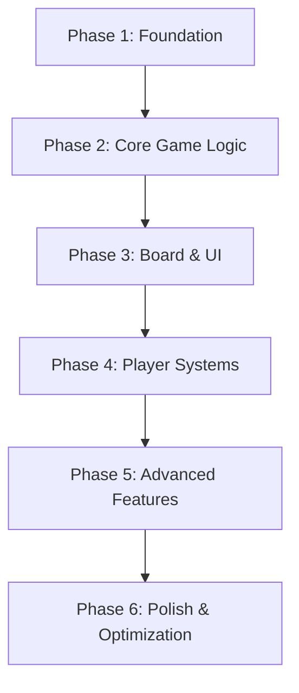

# Implementation Phases and Dependencies

## Phase Overview

The Monopoly game implementation is organized into 6 distinct phases, each building upon the previous phase's deliverables. This approach ensures a stable foundation while enabling incremental testing and validation.



## Phase 1: Foundation Setup
**Duration Estimate**: 1-2 days  
**Dependencies**: None  
**Priority**: Critical

### Deliverables
1. **Project Initialization**
   - Set up Vue.js project with Vite
   - Install dependencies and configure build system
   - Set up development environment

2. **Basic File Structure**
   - Create directory structure as defined in file organization
   - Set up import aliases and path resolution
   - Create placeholder files for major modules

3. **Core State Management**
   - Implement reactive game state structure
   - Create basic player, board, and game state objects
   - Set up computed properties for derived state

4. **Static Data Configuration**
   - Define board space configuration
   - Create property data with prices and rent schedules
   - Set up game constants and settings

### Technical Tasks
```bash
# Project setup commands
npm create vue@latest monopoly-game
cd monopoly-game
npm install
npm run dev
```

### Key Files to Implement
- `package.json` - Project configuration
- `vite.config.js` - Build configuration
- `src/main.js` - Application entry point
- `src/game/state/gameState.js` - Core reactive state
- `src/data/boardConfig.js` - Board layout data
- `src/data/propertyData.js` - Property definitions
- `src/utils/constants.js` - Game constants

### Success Criteria
- Development server runs without errors
- Basic Vue app renders
- Game state is reactive and accessible
- Static data loads correctly

---

## Phase 2: Core Game Logic
**Duration Estimate**: 2-3 days  
**Dependencies**: Phase 1 complete  
**Priority**: Critical

### Deliverables
1. **Game Engine Foundation**
   - Turn management system
   - Dice rolling mechanics
   - Basic player movement
   - Win/lose condition checking

2. **Property System**
   - Property ownership management
   - Rent calculation logic
   - Purchase/sale mechanics
   - Monopoly detection

3. **Economic System**
   - Money transfer functions
   - Transaction validation
   - Bankruptcy detection
   - Asset valuation

4. **Event System**
   - Game event definitions
   - Event emission and handling
   - Action processing pipeline

### Technical Implementation Priority
1. **Turn Manager** (`src/game/logic/turnManager.js`)
   ```javascript
   export const turnManager = {
     startTurn(playerId),
     endTurn(),
     nextPlayer(),
     validateTurnActions()
   }
   ```

2. **Movement System** (`src/game/logic/moveProcessor.js`)
   ```javascript
   export const moveProcessor = {
     movePlayer(playerId, spaces),
     processLanding(playerId, position),
     handlePassGo(playerId)
   }
   ```

3. **Property System** (`src/game/systems/propertySystem.js`)
   ```javascript
   export const propertySystem = {
     purchaseProperty(playerId, propertyId),
     calculateRent(propertyId, diceRoll),
     checkMonopoly(colorGroup),
     transferOwnership(propertyId, newOwnerId)
   }
   ```

### Key Files to Implement
- `src/game/logic/gameEngine.js` - Main game controller
- `src/game/logic/turnManager.js` - Turn flow management
- `src/game/logic/moveProcessor.js` - Player movement
- `src/game/systems/propertySystem.js` - Property management
- `src/game/systems/economicSystem.js` - Financial transactions
- `src/game/events/gameEvents.js` - Event definitions

### Success Criteria
- Players can take turns in sequence
- Dice rolling works correctly
- Players move around board accurately
- Property purchases function
- Rent collection works
- Basic win/lose detection functions

---

## Phase 3: Board Visualization & Basic UI
**Duration Estimate**: 3-4 days  
**Dependencies**: Phase 2 complete  
**Priority**: Critical

### Deliverables
1. **Board Component System**
   - Main game board layout
   - Individual board space components
   - Player piece visualization
   - Property ownership indicators

2. **Core UI Components**
   - Player information panels
   - Game control interfaces
   - Dice rolling UI
   - Basic action buttons

3. **Layout System**
   - Responsive grid layout
   - CSS styling framework
   - Mobile-friendly design
   - Animation foundations

### Implementation Order
1. **Board Layout** (`src/components/board/GameBoard.vue`)
   - CSS Grid 11×11 layout
   - 40 board spaces positioned correctly
   - Center area for game information

2. **Board Spaces** (`src/components/board/BoardSpace.vue`)
   - Generic space component
   - Property-specific displays
   - Special space indicators
   - Click interaction handlers

3. **Player Pieces** (`src/components/board/PlayerPieces.vue`)
   - Visual player representations
   - Positioning on board spaces
   - Movement animations

4. **Player Panels** (`src/components/players/PlayerPanels.vue`)
   - Individual player information
   - Money and property displays
   - Current turn indicators

### Key Files to Implement
- `src/App.vue` - Root application component
- `src/components/board/GameBoard.vue` - Main board
- `src/components/board/BoardSpace.vue` - Individual spaces
- `src/components/board/PropertySpace.vue` - Property displays
- `src/components/players/PlayerPanel.vue` - Player info
- `src/components/controls/DiceRoller.vue` - Dice interface
- `src/styles/main.css` - Core styling
- `src/styles/components/board.css` - Board-specific styles

### Success Criteria
- Board renders correctly with all 40 spaces
- Player pieces display on correct positions
- Player information shows accurately
- Basic interactions work (dice rolling, property selection)
- Responsive design works on different screen sizes

---

## Phase 4: Advanced Player Systems
**Duration Estimate**: 3-4 days  
**Dependencies**: Phase 3 complete  
**Priority**: High

### Deliverables
1. **Property Development System**
   - House and hotel building
   - Development rule enforcement
   - Visual development indicators
   - Cost calculations

2. **Trading System**
   - Player-to-player property trades
   - Money exchange in trades
   - Trade proposal interface
   - Trade validation

3. **Mortgage System**
   - Property mortgage/unmortgage
   - Interest calculations
   - Asset liquidation for bankruptcy
   - Mortgage status indicators

4. **Enhanced UI Components**
   - Property development modal
   - Trading interface
   - Mortgage management
   - Action confirmation dialogs

### Implementation Priority
1. **Development System** (`src/game/systems/developmentSystem.js`)
   ```javascript
   export const developmentSystem = {
     canBuildHouse(propertyId),
     buildHouse(propertyId),
     buildHotel(propertyId),
     validateEvenDevelopment(colorGroup)
   }
   ```

2. **Trading System** (`src/game/systems/tradeSystem.js`)
   ```javascript
   export const tradeSystem = {
     createTradeOffer(fromPlayer, toPlayer, offer),
     validateTrade(tradeOffer),
     executeTrade(tradeOffer),
     cancelTrade(tradeId)
   }
   ```

3. **Modal System** (`src/components/modals/`)
   - Property purchase confirmations
   - Development interface
   - Trading interface
   - Bankruptcy resolution

### Key Files to Implement
- `src/game/systems/developmentSystem.js` - Building mechanics
- `src/game/systems/tradeSystem.js` - Trading logic
- `src/game/systems/bankruptcySystem.js` - Bankruptcy handling
- `src/components/modals/DevelopmentModal.vue` - Building UI
- `src/components/modals/TradeModal.vue` - Trading interface
- `src/components/modals/PropertyPurchaseModal.vue` - Purchase UI
- `src/utils/validation.js` - Input validation utilities

### Success Criteria
- Players can build houses and hotels on monopolies
- Trading interface allows complex property/money exchanges
- Mortgage system functions correctly
- Bankruptcy procedures work properly
- All modal interfaces are functional and user-friendly

---

## Phase 5: Card System & Special Mechanics
**Duration Estimate**: 2-3 days  
**Dependencies**: Phase 4 complete  
**Priority**: High

### Deliverables
1. **Card Deck Management**
   - Chance and Community Chest card decks
   - Card shuffling and drawing
   - Discard pile management
   - Deck reshuffling when empty

2. **Card Effect System**
   - Individual card effect implementations
   - Special movement cards (advance to, go back)
   - Money transaction cards
   - Property-based cards (repairs, assessments)
   - Get Out of Jail Free mechanics

3. **Special Spaces**
   - Jail mechanics (visiting vs. in jail)
   - Tax space implementations
   - Free Parking (no effect)
   - Go to Jail functionality

4. **Card Display UI**
   - Card reveal animations
   - Card effect descriptions
   - Keep/discard options for special cards

### Implementation Priority
1. **Card Data** (`src/data/cardData.js`)
   - Complete Chance card definitions
   - Complete Community Chest card definitions
   - Card effect mapping

2. **Card System** (`src/game/systems/cardSystem.js`)
   ```javascript
   export const cardSystem = {
     initializeDecks(),
     drawCard(deckType),
     executeCardEffect(card, playerId),
     reshuffleDeck(deckType)
   }
   ```

3. **Special Mechanics** (`src/game/rules/specialRules.js`)
   - Jail entry and exit
   - Tax collection
   - Special movement rules

### Key Files to Implement
- `src/data/cardData/chanceCards.js` - Chance card data
- `src/data/cardData/communityChestCards.js` - Community Chest data
- `src/game/systems/cardSystem.js` - Card management
- `src/components/cards/CardDisplay.vue` - Card UI
- `src/components/board/SpecialSpace.vue` - Special space handling
- `src/game/rules/specialRules.js` - Special mechanics

### Success Criteria
- Card drawing works from appropriate spaces
- All card effects execute correctly
- Deck management (shuffle, discard) functions
- Special spaces trigger correct actions
- Get Out of Jail Free cards work properly
- Card display UI is clear and intuitive

---

## Phase 6: Polish & Optimization
**Duration Estimate**: 2-3 days  
**Dependencies**: Phase 5 complete  
**Priority**: Medium

### Deliverables
1. **Animation System**
   - Smooth player piece movement
   - Card reveal animations
   - Property purchase feedback
   - Turn transition effects

2. **Game Polish**
   - Sound effect integration (optional)
   - Visual feedback improvements
   - Loading states and transitions
   - Error handling and recovery

3. **Performance Optimization**
   - Component optimization
   - State update efficiency
   - Animation performance
   - Memory usage optimization

4. **Enhanced Features**
   - Game save/load functionality
   - Statistics tracking
   - Game history/undo functionality
   - Accessibility improvements

### Implementation Focus
1. **Animation System** (`src/utils/animations.js`)
   ```javascript
   export const animations = {
     movePlayerPiece(playerId, fromPos, toPos),
     revealCard(cardElement),
     highlightProperty(propertyId),
     showMoneyTransfer(amount, fromPlayer, toPlayer)
   }
   ```

2. **Performance Monitoring**
   - Component render optimization
   - State mutation batching
   - Memory leak prevention
   - Browser compatibility testing

3. **Accessibility**
   - Keyboard navigation
   - Screen reader support
   - High contrast mode
   - Focus management

### Key Files to Implement
- `src/utils/animations.js` - Animation helpers
- `src/utils/storage.js` - Save/load functionality
- `src/game/statistics/gameStats.js` - Statistics tracking
- `src/styles/themes/high-contrast.css` - Accessibility theme
- `src/utils/performance.js` - Performance utilities

### Success Criteria
- All animations are smooth and purposeful
- Game performs well with no noticeable lag
- Save/load functionality works reliably
- Accessibility features function correctly
- Cross-browser compatibility confirmed
- No memory leaks or performance issues

---

## Dependency Graph

### Critical Path Dependencies
```
Foundation → Core Logic → Board UI → Player Systems → Cards → Polish
     ↓           ↓           ↓           ↓           ↓        ↓
  Required    Required    Required    Required    Required  Optional
```

### Parallel Development Opportunities
1. **Phase 1-2**: UI design can be planned while logic is being implemented
2. **Phase 3-4**: Card system development can begin while UI is being polished
3. **Phase 5-6**: Animation work can start once core UI is stable

### Risk Mitigation
1. **State Management**: Get reactive state working early (Phase 1)
2. **Core Logic**: Ensure game rules work before building UI (Phase 2)
3. **Component Architecture**: Test component communication early (Phase 3)
4. **Performance**: Monitor performance throughout, not just in Phase 6

## Testing Strategy by Phase

### Phase 1-2: Logic Testing
- Unit tests for game rules
- State mutation testing
- Turn flow validation

### Phase 3-4: Integration Testing
- Component communication testing
- UI interaction testing
- Cross-browser compatibility

### Phase 5-6: End-to-End Testing
- Complete game scenarios
- Performance testing
- Accessibility testing
- User experience validation

This phased approach ensures steady progress while maintaining code quality and system stability throughout the development process.