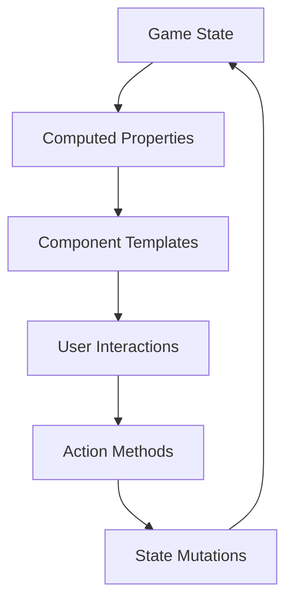

# System Architecture Design

## High-Level Architecture Overview

The Monopoly game follows a **Component-Based Architecture** using Vue.js 3 with reactive state management. The system is organized into distinct layers with clear separation of concerns.

### Architecture Layers

```
┌─────────────────────────────────────────┐
│           Presentation Layer            │
│     (Vue Components & Templates)        │
├─────────────────────────────────────────┤
│            Business Logic               │
│     (Game Rules & State Management)     │
├─────────────────────────────────────────┤
│              Data Layer                 │
│    (Game State & Static Data)          │
└─────────────────────────────────────────┘
```

## Component Architecture

### Component Hierarchy

```
App.vue
├── GameHeader.vue
│   ├── GameStatus.vue
│   └── PlayerTurnIndicator.vue
├── GameBoard.vue
│   ├── BoardSpace.vue (×40)
│   │   ├── PropertySpace.vue
│   │   ├── SpecialSpace.vue (Go, Jail, etc.)
│   │   ├── CardSpace.vue (Chance/Community Chest)
│   │   └── TaxSpace.vue
│   └── PlayerPieces.vue
│       └── PlayerPiece.vue (×n players)
├── PlayerPanels.vue
│   └── PlayerPanel.vue (×n players)
│       ├── PlayerInfo.vue
│       ├── PropertyList.vue
│       └── ActionButtons.vue
├── GameControls.vue
│   ├── DiceRoller.vue
│   ├── ActionPanel.vue
│   └── TradeInterface.vue
├── CardDisplay.vue
│   ├── ChanceCard.vue
│   └── CommunityChestCard.vue
└── GameModals.vue
    ├── PropertyPurchaseModal.vue
    ├── TradeModal.vue
    ├── BankruptcyModal.vue
    └── GameOverModal.vue
```

### Component Responsibilities

#### Core Components

**App.vue**
- Root component and main layout
- Manages global game state
- Coordinates major game events
- Provides reactive context to child components

**GameBoard.vue**
- Renders the 40-space board layout
- Manages board visualization and space interactions
- Handles player piece positioning and movement animations
- Provides click handlers for property interactions

**PlayerPanels.vue**
- Displays all player information and assets
- Shows current player highlight
- Manages player-specific actions and controls
- Provides property management interface

**GameControls.vue**
- Handles turn-based actions (dice rolling, property management)
- Provides action buttons based on current game state
- Manages trade initiation and property development

#### Specialized Components

**DiceRoller.vue**
- Animates dice rolling
- Calculates movement and handles doubles
- Triggers movement events

**PropertySpace.vue**
- Displays property information and ownership
- Shows development level (houses/hotels)
- Handles property click interactions

**CardDisplay.vue**
- Shows drawn Chance/Community Chest cards
- Animates card reveal
- Executes card effects

## Data Flow Architecture

### Reactive State Pattern



### State Management Structure

```javascript
// Central game state (reactive)
const gameState = reactive({
  // Game control
  currentPlayer: 0,
  gamePhase: 'setup', // setup, playing, ended
  turnPhase: 'rolling', // rolling, moving, action, ended
  
  // Players
  players: [...],
  
  // Board state
  board: {...},
  properties: {...},
  
  // Game mechanics
  dice: { value1: 1, value2: 1, doubles: 0 },
  cards: { chance: [...], communityChest: [...] },
  
  // UI state
  selectedProperty: null,
  activeModal: null,
  animations: {...}
})
```

### Event Flow Patterns

#### Turn-Based Actions
```
User Input → Action Validation → State Update → UI Reaction → Next Turn Check
```

#### Property Interactions
```
Property Click → Ownership Check → Action Options → User Choice → Transaction → State Update
```

#### Card Drawing
```
Land on Card Space → Draw Card → Display Card → Execute Effect → Continue Turn
```

## System Boundaries and Interfaces

### Game Engine Interface
```javascript
// gameEngine.js - Core game logic
export const gameEngine = {
  // Game flow control
  startGame(playerCount),
  endTurn(),
  processMove(playerId, diceResult),
  
  // Property system
  purchaseProperty(playerId, propertyId),
  payRent(playerId, propertyId),
  developProperty(propertyId, development),
  
  // Card system
  drawCard(deckType),
  executeCard(cardId, playerId),
  
  // Economic system
  transferMoney(fromId, toId, amount),
  handleBankruptcy(playerId),
  
  // Validation
  canAfford(playerId, amount),
  canDevelop(propertyId),
  isGameOver()
}
```

### Component Communication Interface
```javascript
// Event system for component communication
const gameEvents = {
  // Player actions
  emit('dice-rolled', { player, result }),
  emit('property-selected', { propertyId }),
  emit('trade-initiated', { players, properties }),
  
  // Game state changes
  emit('player-moved', { player, position }),
  emit('property-purchased', { player, property }),
  emit('game-over', { winner }),
  
  // UI events
  emit('modal-opened', { type, data }),
  emit('animation-started', { type, target })
}
```

## Module Organization

### Core Modules

**gameState.js**
- Reactive game state definition
- State initialization and reset
- Global state accessors

**gameLogic.js**
- Turn management
- Rule enforcement
- Win/lose condition checking
- Action validation

**boardData.js**
- Static board configuration
- Property definitions
- Card deck definitions

**propertySystem.js**
- Property ownership management
- Rent calculation
- Development logic
- Mortgage system

**economicSystem.js**
- Money transfers
- Bankruptcy handling
- Asset valuation
- Transaction logging

**cardSystem.js**
- Card deck management
- Card effect execution
- Shuffle and draw logic

### Utility Modules

**animations.js**
- Player piece movement
- Card reveal animations
- Property purchase effects
- UI transitions

**validation.js**
- Input validation
- Rule checking
- Error handling

**constants.js**
- Game configuration
- Property data
- UI constants

## Scalability Considerations

### Performance Optimizations
- **Computed Properties**: For derived state calculations
- **Component Lazy Loading**: For modals and complex components  
- **Event Delegation**: For board space interactions
- **Virtual Scrolling**: For large property lists (if needed)

### Extensibility Points
- **Plugin System**: For additional game rules or variants
- **Theme System**: For different visual styles
- **Rule Customization**: Configurable game parameters
- **AI Players**: Interface for computer players

### State Persistence
- **Local Storage**: For game save/load functionality
- **Game History**: For undo/redo capabilities
- **Session Management**: For page refresh recovery

This architecture provides a solid foundation for implementing a complete, maintainable, and extensible Monopoly game while maintaining clear separation of concerns and reactive data flow.