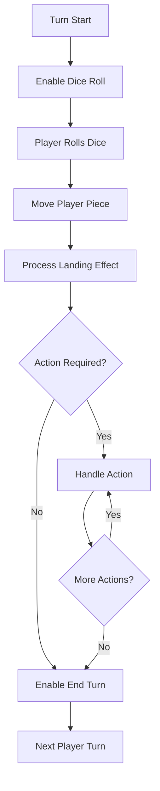

# Monopoly Game Technical Specifications

## 1. Project Overview

### 1.1 Purpose
A complete web-based implementation of the Monopoly board game supporting 2-8 players in a single browser session at localhost. The game includes all core Monopoly mechanics with digital-first optimizations (no physical money bills, text-based visual design).

### 1.2 Technology Stack
- **Frontend Framework**: Vue.js 3 with Composition API
- **Build Tool**: Vite for development and bundling
- **Styling**: Custom CSS with Grid/Flexbox layouts
- **State Management**: Vue 3 reactive system
- **Development Environment**: Node.js + npm

### 1.3 Target Requirements
- **Platform**: Web browser (localhost deployment)
- **Players**: 2-8 players taking turns on same device
- **Assets**: Text and colored rectangles only
- **Performance**: Smooth 60fps animations, sub-100ms interactions
- **Compatibility**: Modern browsers (ES2020+)

## 2. System Architecture

### 2.1 High-Level Architecture
```
┌─────────────────────────────────────┐
│        Presentation Layer           │
│    (Vue Components & Templates)     │
├─────────────────────────────────────┤
│         Business Logic              │
│   (Game Rules & State Management)   │
├─────────────────────────────────────┤
│           Data Layer                │
│   (Reactive Game State & Config)    │
└─────────────────────────────────────┘
```

### 2.2 Core Modules
- **Game Engine**: Turn management, rule enforcement, win conditions
- **Property System**: Ownership, rent calculation, development
- **Economic System**: Money transfers, bankruptcy handling
- **Card System**: Deck management, effect execution
- **UI System**: Component rendering, user interactions
- **Animation System**: Smooth transitions and feedback

### 2.3 Data Flow Pattern
Unidirectional reactive data flow using Vue's reactivity system:
```
User Input → Action Methods → State Mutations → Computed Properties → UI Updates
```

## 3. Data Models

### 3.1 Core Entities

#### Player Model
```typescript
interface Player {
  id: string
  name: string
  color: string          // Hex color for piece
  money: number
  position: number       // 0-39 board position
  isActive: boolean
  isBankrupt: boolean
  isInJail: boolean
  jailTurns: number     // 0-3
  getOutOfJailCards: number
  properties: number[]   // Property IDs
  railroads: number[]   // Railroad IDs  
  utilities: number[]   // Utility IDs
  houses: number        // Total houses owned
  hotels: number        // Total hotels owned
  stats: PlayerStats
}
```

#### Property Model
```typescript
interface Property {
  id: number            // Board position
  name: string
  colorGroup: string
  price: number
  rent: number[]        // [base, 1h, 2h, 3h, 4h, hotel]
  houseCost: number
  mortgageValue: number
  ownerId: string | null
  isMortgaged: boolean
  houses: number        // 0-4
  hasHotel: boolean
  currentRent: number   // Computed
  isPartOfMonopoly: boolean // Computed
}
```

#### Game State Model
```typescript
interface GameState {
  gameId: string
  gamePhase: 'setup' | 'playing' | 'paused' | 'ended'
  turnPhase: 'rolling' | 'moving' | 'action' | 'trading'
  players: Player[]
  currentPlayerIndex: number
  playerCount: number
  activePlayers: number
  turnNumber: number
  dice: DiceState
  board: BoardSpace[]
  properties: Record<number, Property>
  railroads: Record<number, Railroad>
  utilities: Record<number, Utility>
  chanceCards: Card[]
  communityChestCards: Card[]
  bank: BankState
  selectedProperty: number | null
  activeModal: string | null
  animations: AnimationState
  settings: GameSettings
}
```

### 3.2 Board Configuration
- **Total Spaces**: 40 (indexed 0-39)
- **Properties**: 22 standard properties in 8 color groups
- **Railroads**: 4 railroads at positions 5, 15, 25, 35
- **Utilities**: 2 utilities at positions 12, 28
- **Special Spaces**: GO, Jail, Free Parking, Go to Jail, Taxes
- **Card Spaces**: 3 Chance, 3 Community Chest

### 3.3 Economic System
- **Starting Money**: $1,500 per player
- **GO Salary**: $200
- **House Limit**: 32 houses total
- **Hotel Limit**: 12 hotels total
- **Bankruptcy Threshold**: Cannot pay required amount

## 4. User Interface Specifications

### 4.1 Layout Structure
CSS Grid layout with responsive design:
```css
.game-container {
  display: grid;
  grid-template-areas: 
    "header header"
    "players board"
    "controls controls";
  grid-template-rows: 60px 1fr 80px;
  grid-template-columns: 300px 1fr;
}
```

### 4.2 Board Visualization
- **Layout**: 11×11 CSS Grid (40 spaces around perimeter + center info area)
- **Space Size**: Minimum 80px × 120px for readability
- **Player Pieces**: Colored circles positioned on current space
- **Property Indicators**: Color bars, ownership markers, development icons
- **Animation**: Smooth piece movement with CSS transitions

### 4.3 Component Hierarchy
```
App.vue
├── GameHeader.vue (game status, turn indicator)
├── GameBoard.vue
│   ├── BoardSpace.vue (×40)
│   └── PlayerPieces.vue
├── PlayerPanels.vue
│   └── PlayerPanel.vue (×n players)
├── GameControls.vue
│   ├── DiceRoller.vue
│   └── ActionButtons.vue
├── CardDisplay.vue
└── GameModals.vue (purchase, trade, etc.)
```

### 4.4 Responsive Design Breakpoints
- **Desktop**: > 1024px (side-by-side layout)
- **Tablet**: 768px - 1024px (stacked layout)
- **Mobile**: < 768px (compact stacked layout)

## 5. Game Mechanics Implementation

### 5.1 Turn Flow


### 5.2 Property System
- **Purchase**: Available when landing on unowned property
- **Rent**: Automatic collection when opponent lands
- **Development**: Houses then hotels on monopolies only
- **Mortgage**: Half purchase price, 10% interest to unmortgage
- **Monopoly Bonus**: Double rent without development

### 5.3 Card System
- **Deck Management**: Shuffle, draw, discard, reshuffle when empty
- **Effect Types**: Movement, money, property-based, special
- **Get Out of Jail Free**: Tradeable, returns to random deck
- **Execution**: Immediate effect processing with UI feedback

### 5.4 Economic Rules
- **Money Transfers**: Always validated for sufficient funds
- **Bankruptcy**: Triggered when cannot pay debts
- **Asset Liquidation**: Houses/hotels → mortgage → property transfer
- **Bank Transactions**: Unlimited bank money supply

## 6. Technical Implementation Details

### 6.1 State Management
Vue 3 Composition API with reactive state:
```javascript
// gameState.js
import { reactive, computed } from 'vue'

export const gameState = reactive({
  // Core state properties
  players: [],
  currentPlayerIndex: 0,
  // ... other state
})

export const currentPlayer = computed(() => 
  gameState.players[gameState.currentPlayerIndex]
)
```

### 6.2 Event System
Component communication via emit/listen pattern:
```javascript
// Game events
emit('dice-rolled', { player, result })
emit('property-purchased', { player, property })
emit('player-moved', { player, from, to })
emit('game-over', { winner })
```

### 6.3 Animation System
CSS-based animations with JavaScript coordination:
```javascript
// Player movement animation
const movePlayer = (playerId, fromPos, toPos) => {
  // Calculate path, animate CSS transform
  // Trigger landing effects after animation
}
```

### 6.4 Validation Layer
Input validation and game rule enforcement:
```javascript
const validation = {
  canAfford: (playerId, amount) => boolean,
  canDevelop: (propertyId) => boolean,
  canEndTurn: (playerId) => boolean,
  isValidTrade: (offer) => boolean
}
```

## 7. Performance Requirements

### 7.1 Response Times
- **Dice Roll**: < 50ms response time
- **Property Purchase**: < 100ms processing
- **Turn Transitions**: < 200ms total time
- **Animation Duration**: 300-500ms per movement

### 7.2 Memory Usage
- **Game State**: < 1MB total memory
- **Component Instances**: Efficient Vue component reuse
- **Animation Cleanup**: Proper cleanup of CSS animations

### 7.3 Browser Compatibility
- **Modern Browsers**: Chrome 90+, Firefox 88+, Safari 14+, Edge 90+
- **Features Required**: ES2020, CSS Grid, CSS Flexbox
- **Fallbacks**: Graceful degradation for older browsers

## 8. Error Handling

### 8.1 User Input Validation
- **Monetary Amounts**: Non-negative integers only
- **Player Actions**: Validate against current game state
- **Trade Proposals**: Mutual benefit validation

### 8.2 Game State Corruption
- **State Validation**: Regular integrity checks
- **Recovery**: Reset to last valid state
- **Logging**: Detailed error logging for debugging

### 8.3 Edge Cases
- **Simultaneous Bankruptcy**: Handle multiple players eliminating
- **Infinite Loops**: Prevention in trading and property development
- **Network Issues**: Local-only game, no network dependencies

## 9. Testing Strategy

### 9.1 Unit Testing
- **Game Logic**: Pure function testing for calculations
- **State Mutations**: Validate state changes
- **Rule Enforcement**: Test all game rule edge cases

### 9.2 Integration Testing
- **Component Integration**: Test component communication
- **User Flows**: Complete turn sequences
- **Game Completion**: Full game scenarios

### 9.3 Manual Testing
- **UI/UX**: Visual design and interaction testing
- **Performance**: Animation smoothness, response times
- **Cross-browser**: Compatibility verification

## 10. Deployment Specifications

### 10.1 Development Setup
```bash
# Project initialization
npm create vue@latest monopoly-game
cd monopoly-game
npm install
npm run dev
```

### 10.2 Build Configuration
- **Development**: Vite dev server with hot reload
- **Production**: Optimized build with minification
- **Assets**: Inline small assets, optimize large ones

### 10.3 File Structure
```
sonnet/
├── package.json
├── vite.config.js
├── index.html
├── src/
│   ├── main.js
│   ├── App.vue
│   ├── components/
│   ├── game/
│   ├── data/
│   └── styles/
└── public/
    └── favicon.ico
```

## 11. Future Enhancements

### 11.1 Potential Features
- **Save/Load Game**: LocalStorage persistence
- **Game Statistics**: Player performance tracking
- **Rule Variants**: House rules and game modes
- **AI Players**: Computer opponents
- **Multiplayer**: Network-based multiplayer

### 11.2 Scalability Considerations
- **Modular Architecture**: Easy feature addition
- **Plugin System**: Custom rule implementations
- **Theme Support**: Visual customization
- **Internationalization**: Multi-language support

This technical specification provides comprehensive guidance for implementing a complete, professional-quality Monopoly game while maintaining clarity and architectural integrity throughout the development process.