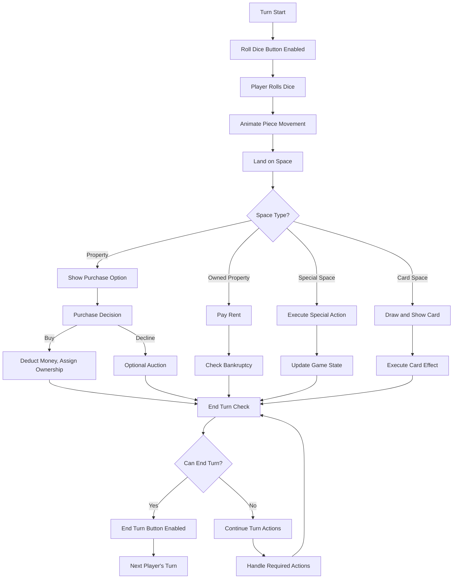
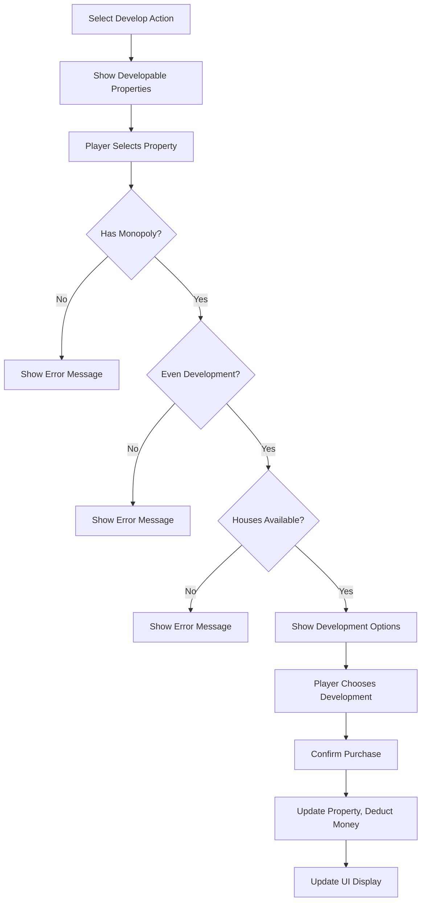

# UI Layout and Interaction Design

## Overall Game Layout

### Main Game Screen Layout

```
┌─────────────────────────────────────────────────────────────┐
│                     Game Header                             │
│  [Game Title] [Turn: Player 2] [Phase: Action] [Time: 45:23]│
├─────────────────────────────────────────────────────────────┤
│  Player Panels                    │        Game Board       │
│ ┌─────────────────┐               │                         │
│ │     Player 1    │               │    ┌─────────────────┐  │
│ │ Money: $1,245   │               │    │ ┌─┬─┬─┬─┬─┬─┬─┬─┐ │  │
│ │ Properties: 3   │               │    │ │ │ │ │ │ │ │ │ │ │  │
│ │ [Active/Turn]   │               │    │ ├─┼─┼─┼─┼─┼─┼─┼─┤ │  │
│ └─────────────────┘               │    │ │ │ │ │ │ │ │ │ │ │  │
│ ┌─────────────────┐               │    │ ├─┼─┼─┼─┼─┼─┼─┼─┤ │  │
│ │     Player 2    │               │    │ │ │ │ │ │ │ │ │ │ │  │
│ │ Money: $967     │               │    │ ├─┼─┼─┼─┼─┼─┼─┼─┤ │  │
│ │ Properties: 5   │               │    │ │ │ │ │ │ │ │ │ │ │  │
│ │ [Inactive]      │               │    │ └─┴─┴─┴─┴─┴─┴─┴─┘ │  │
│ └─────────────────┘               │    └─────────────────┘  │
│ ┌─────────────────┐               │                         │
│ │     Player 3    │               │                         │
│ │ Money: $1,834   │               │                         │
│ │ Properties: 2   │               │                         │
│ │ [Inactive]      │               │                         │
│ └─────────────────┘               │                         │
├─────────────────────────────────────────────────────────────┤
│                     Game Controls                           │
│     [Roll Dice] [End Turn] [Trade] [Develop] [Mortgage]     │
└─────────────────────────────────────────────────────────────┘
```

### CSS Grid Layout Structure

```css
.game-container {
  display: grid;
  grid-template-areas: 
    "header header"
    "players board"
    "controls controls";
  grid-template-rows: 60px 1fr 80px;
  grid-template-columns: 300px 1fr;
  height: 100vh;
  gap: 10px;
}

.game-header { grid-area: header; }
.player-panels { grid-area: players; }
.game-board { grid-area: board; }
.game-controls { grid-area: controls; }
```

## Board Visualization Design

### Board Space Layout
The board uses a CSS Grid approach with a 11x11 grid (center area + border spaces):

```
┌─────┬─────┬─────┬─────┬─────┬─────┬─────┬─────┬─────┬─────┬─────┐
│ 20  │ 21  │ 22  │ 23  │ 24  │ 25  │ 26  │ 27  │ 28  │ 29  │ 30  │
├─────┼─────┼─────┼─────┼─────┼─────┼─────┼─────┼─────┼─────┼─────┤
│ 19  │                                                     │ 31  │
├─────┤                    GAME INFO                        ├─────┤
│ 18  │                                                     │ 32  │
├─────┤                 - Current Turn                      ├─────┤
│ 17  │                 - Dice Results                      │ 33  │
├─────┤                 - Last Action                       ├─────┤
│ 16  │                 - Game Messages                     │ 34  │
├─────┤                                                     ├─────┤
│ 15  │                                                     │ 35  │
├─────┤                                                     ├─────┤
│ 14  │                                                     │ 36  │
├─────┼─────┼─────┼─────┼─────┼─────┼─────┼─────┼─────┼─────┼─────┤
│ 13  │ 12  │ 11  │ 10  │  9  │  8  │  7  │  6  │  5  │  4  │  3  │
└─────┴─────┴─────┴─────┴─────┴─────┴─────┴─────┴─────┴─────┴─────┘
```

### Board Space Component Design

```html
<!-- PropertySpace.vue template -->
<div class="board-space property-space" :class="spaceClasses">
  <!-- Color bar for property group -->
  <div class="color-bar" :style="{ backgroundColor: property.colorGroup }"></div>
  
  <!-- Property name -->
  <div class="property-name">{{ property.name }}</div>
  
  <!-- Price -->
  <div class="property-price">${{ property.price }}</div>
  
  <!-- Ownership indicator -->
  <div class="ownership-indicator" v-if="property.ownerId">
    <div class="owner-color" :style="{ backgroundColor: ownerColor }"></div>
  </div>
  
  <!-- Development indicators -->
  <div class="development-row" v-if="property.houses > 0 || property.hasHotel">
    <div class="house" v-for="n in property.houses" :key="n">🏠</div>
    <div class="hotel" v-if="property.hasHotel">🏨</div>
  </div>
  
  <!-- Player pieces on this space -->
  <div class="player-pieces">
    <div 
      class="player-piece" 
      v-for="player in playersOnSpace" 
      :key="player.id"
      :style="{ backgroundColor: player.color }"
    ></div>
  </div>
</div>
```

## Player Panel Design

### Individual Player Panel Layout

```html
<div class="player-panel" :class="{ active: isCurrentPlayer, bankrupt: player.isBankrupt }">
  <!-- Player Header -->
  <div class="player-header">
    <div class="player-piece" :style="{ backgroundColor: player.color }"></div>
    <h3 class="player-name">{{ player.name }}</h3>
    <div class="turn-indicator" v-if="isCurrentPlayer">👑</div>
  </div>
  
  <!-- Financial Info -->
  <div class="financial-info">
    <div class="money-display">
      <span class="label">Cash:</span>
      <span class="amount">${{ player.money.toLocaleString() }}</span>
    </div>
    <div class="net-worth">
      <span class="label">Net Worth:</span>
      <span class="amount">${{ player.netWorth.toLocaleString() }}</span>
    </div>
  </div>
  
  <!-- Property Summary -->
  <div class="property-summary">
    <div class="property-count">
      <span class="count">{{ player.properties.length }}</span>
      <span class="label">Properties</span>
    </div>
    <div class="monopoly-count">
      <span class="count">{{ player.monopolies.length }}</span>
      <span class="label">Monopolies</span>
    </div>
  </div>
  
  <!-- Property List (Expandable) -->
  <div class="property-list" v-if="showProperties">
    <div 
      class="property-item" 
      v-for="property in player.properties" 
      :key="property.id"
      @click="selectProperty(property)"
    >
      <div class="color-indicator" :style="{ backgroundColor: property.colorGroup }"></div>
      <span class="property-name">{{ property.name }}</span>
      <span class="property-rent">${{ property.currentRent }}</span>
    </div>
  </div>
  
  <!-- Action Buttons (for current player) -->
  <div class="player-actions" v-if="isCurrentPlayer">
    <button class="action-btn" @click="showTradeModal">Trade</button>
    <button class="action-btn" @click="showDevelopModal">Develop</button>
    <button class="action-btn" @click="showMortgageModal">Mortgage</button>
  </div>
</div>
```

## Game Controls Interface

### Primary Control Panel
```html
<div class="game-controls">
  <!-- Dice Section -->
  <div class="dice-section">
    <div class="dice-container">
      <div class="die" :class="{ rolling: diceRolling }">{{ dice.die1 }}</div>
      <div class="die" :class="{ rolling: diceRolling }">{{ dice.die2 }}</div>
    </div>
    <button 
      class="roll-button" 
      @click="rollDice" 
      :disabled="!canRollDice"
    >
      Roll Dice
    </button>
  </div>
  
  <!-- Action Buttons -->
  <div class="action-buttons">
    <button 
      class="action-btn primary" 
      @click="buyProperty" 
      v-if="canBuyProperty"
    >
      Buy Property (${{ selectedProperty.price }})
    </button>
    
    <button 
      class="action-btn secondary" 
      @click="endTurn" 
      :disabled="!canEndTurn"
    >
      End Turn
    </button>
    
    <button 
      class="action-btn" 
      @click="openTradeModal"
    >
      Trade
    </button>
    
    <button 
      class="action-btn" 
      @click="openDevelopModal"
    >
      Develop
    </button>
  </div>
  
  <!-- Game Messages -->
  <div class="game-messages">
    <div class="message" v-for="message in recentMessages" :key="message.id">
      {{ message.text }}
    </div>
  </div>
</div>
```

## Modal Dialog Designs

### Property Purchase Modal
```html
<div class="modal property-purchase-modal">
  <div class="modal-content">
    <h2>Purchase Property</h2>
    
    <div class="property-details">
      <div class="property-card">
        <div class="color-bar" :style="{ backgroundColor: property.colorGroup }"></div>
        <h3>{{ property.name }}</h3>
        <div class="price">Price: ${{ property.price }}</div>
        <div class="rent-info">
          <div class="rent-row">Base Rent: ${{ property.rent[0] }}</div>
          <div class="rent-row">With Monopoly: ${{ property.rent[0] * 2 }}</div>
          <div class="rent-row">With 1 House: ${{ property.rent[1] }}</div>
          <div class="rent-row">With Hotel: ${{ property.rent[5] }}</div>
        </div>
      </div>
    </div>
    
    <div class="modal-actions">
      <button class="btn primary" @click="confirmPurchase">
        Buy for ${{ property.price }}
      </button>
      <button class="btn secondary" @click="declinePurchase">
        Decline
      </button>
      <button class="btn tertiary" @click="startAuction">
        Start Auction
      </button>
    </div>
  </div>
</div>
```

### Trade Interface Modal
```html
<div class="modal trade-modal">
  <div class="modal-content large">
    <h2>Trade Proposal</h2>
    
    <div class="trade-interface">
      <!-- Player Selection -->
      <div class="player-selection">
        <label>Trade with:</label>
        <select v-model="selectedTradePartner">
          <option v-for="player in otherPlayers" :value="player.id">
            {{ player.name }}
          </option>
        </select>
      </div>
      
      <!-- Trade Offer Section -->
      <div class="trade-offer">
        <div class="offer-side">
          <h3>You Give:</h3>
          <div class="money-offer">
            <label>Money: $</label>
            <input type="number" v-model="offer.money" min="0" :max="currentPlayer.money">
          </div>
          <div class="property-selection">
            <h4>Properties:</h4>
            <div 
              class="property-option" 
              v-for="property in currentPlayer.properties"
              :key="property.id"
            >
              <input 
                type="checkbox" 
                :id="'give-' + property.id"
                v-model="offer.properties"
                :value="property.id"
              >
              <label :for="'give-' + property.id">{{ property.name }}</label>
            </div>
          </div>
        </div>
        
        <div class="offer-side">
          <h3>You Get:</h3>
          <div class="money-request">
            <label>Money: $</label>
            <input type="number" v-model="request.money" min="0">
          </div>
          <div class="property-selection">
            <h4>Properties:</h4>
            <div 
              class="property-option" 
              v-for="property in tradePartner.properties"
              :key="property.id"
            >
              <input 
                type="checkbox" 
                :id="'get-' + property.id"
                v-model="request.properties"
                :value="property.id"
              >
              <label :for="'get-' + property.id">{{ property.name }}</label>
            </div>
          </div>
        </div>
      </div>
    </div>
    
    <div class="modal-actions">
      <button class="btn primary" @click="proposeTrade">Propose Trade</button>
      <button class="btn secondary" @click="closeModal">Cancel</button>
    </div>
  </div>
</div>
```

## Interaction Flow Patterns

### Turn-Based Game Flow



### Property Development Flow



## Responsive Design Considerations

### Mobile Layout (< 768px)
```css
@media (max-width: 768px) {
  .game-container {
    grid-template-areas: 
      "header"
      "board"
      "players"
      "controls";
    grid-template-rows: 60px 50vh 1fr 80px;
    grid-template-columns: 1fr;
  }
  
  .player-panels {
    display: flex;
    overflow-x: auto;
    gap: 10px;
  }
  
  .player-panel {
    min-width: 200px;
    flex-shrink: 0;
  }
}
```

### Tablet Layout (768px - 1024px)
```css
@media (min-width: 768px) and (max-width: 1024px) {
  .game-container {
    grid-template-columns: 250px 1fr;
  }
  
  .player-panel {
    margin-bottom: 10px;
  }
}
```

## Accessibility Features

### Keyboard Navigation
- Tab order: Dice → Action Buttons → Property Interactions
- Enter/Space for button activation
- Arrow keys for property selection
- Escape to close modals

### Screen Reader Support
```html
<!-- ARIA labels and descriptions -->
<button 
  class="roll-button" 
  aria-label="Roll dice to move your piece"
  aria-describedby="dice-instructions"
>
  Roll Dice
</button>

<div class="board-space" 
  role="button" 
  tabindex="0"
  aria-label="Mediterranean Avenue, Brown property, Price $60, Owned by Player 1"
>
```

### Visual Accessibility
- High contrast mode support
- Color-blind friendly property colors
- Large touch targets (44px minimum)
- Clear focus indicators

This comprehensive UI design provides an intuitive, accessible, and responsive interface for the Monopoly game while maintaining visual clarity and supporting complex game interactions.